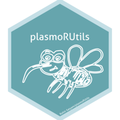

<!-- README.md is generated from README.Rmd. Please edit that file -->

```{r, include = FALSE}
knitr::opts_chunk$set(
  collapse = TRUE, eval = FALSE,
  comment = "#>",
  fig.path = "man/figures/README-",
  out.width = "100%"
)
```

# plasmoRUtils 

`plasmoRUtils` enables users to connect to several *Plasmodium* and other apicomplexan databases via R interface and provides simple functions to carry out other bioinformatics tasks which are non-trival for parasite informatic analysis. For further details, we recommend you read our preprint.


<!-- badges: start -->

[](https://lifecycle.r-lib.org/articles/stages.html#experimental)
[](https://codecov.io/gh/Rohit-Satyam/plasmoRUtils)
[](https://choosealicense.com/licenses/mit/)
[](https://cran.r-project.org/)
[](commits/master)
[](/commits/master)
<!-- badges: end -->

## Installation
Before downloading the package, install the following dependencies.

```{r}
cranpkgs <- c('BiocManager','randomcoloR', 'janitor', 'readr', 'rlang', 'dplyr', 'ggsci', 'rvest', 'easyPubMed', 'plyr', 'scales', 'ggplot2', 'glue', 'tidyr', 'tibble', 'data.table', 'plotly', 'purrr', 'stringr', 'S4Vectors', 'echarts4r', 'magrittr', 'bio3d', 'httr', 'jsonlite', 'ggpubr', 'gt', 'mgsub', 'reshape2','pathfindR')

install.packages(setdiff(cranpkgs, rownames(installed.packages())), dependencies = TRUE)

biocpkgs <- c("rmarkdown","pRoloc","knitr","BiocStyle","DESeq2","styler","utils","IRanges","BiocGenerics","rtracklayer","scuttle","txdbmaker","topGO","drawProteins","GenomicFeatures","biomaRt","AnnotationForge","Biostrings","GenomeInfoDb","SingleCellExperiment","SingleR","NOISeq","GenomicRanges","BSgenome")

BiocManager::install(setdiff(biocpkgs, rownames(installed.packages())), dependencies = TRUE)

```

You can install the development version of `plasmoRUtils` using:

```{r}
devtools::install_github("Rohit-Satyam/plasmoRUtils")
remotes::install_github('Rohit-Satyam/plasmoRUtils')
```

## Check installation

Once dependencies are installed, the package can be loaded as follows:

```{r}
# Once installed load the library as
library(plasmoRUtils)

## To re-check if all the dependencies that are required by plasmoRUtils are installed
install_dependencies()
```

## Documentation

The documentation of this package is available [here]("https://Rohit-Satyam.org/plasmoRUtils/index.html")

## To-do List

1. Provide function to access Plasmobase.
2. Write wrapper function easypathFindR to quickly perform Pathway enrichment analysis.
3. Write function to make String PPI quickly.


## Contributing

We’re excited to have you contribute to this package! If you’d like to
help out, try to follow the same style and conventions used in the
current functions - where it makes sense, of course. If you have any
ideas or suggestions, don’t hesitate to reach out—opening a GitHub issue
is usually the best way to start the conversation.

> Just a heads up: this project has a Contributor Code of Conduct, so by
> getting involved, you’re agreeing to play by those rules. Thanks for
> helping make this project better!

