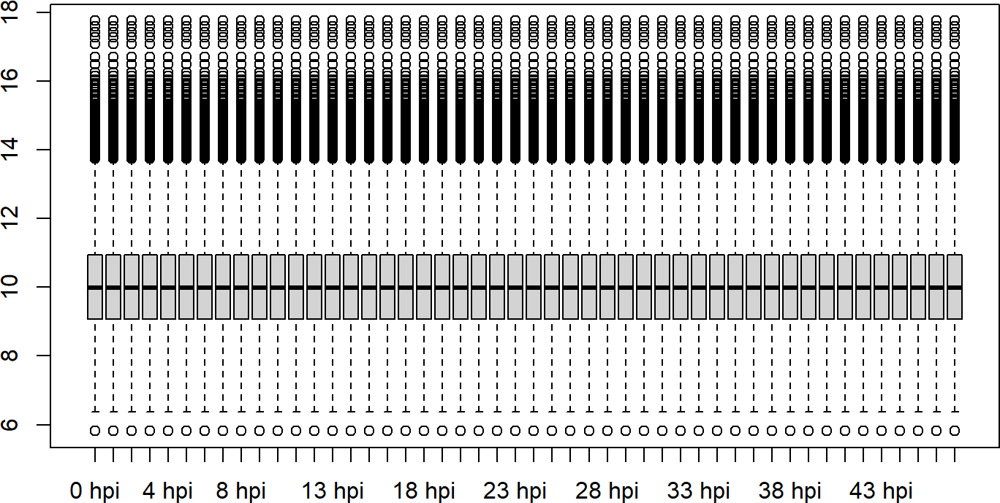
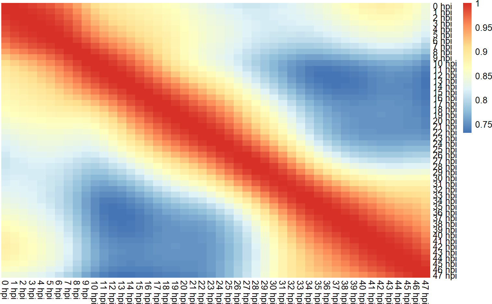
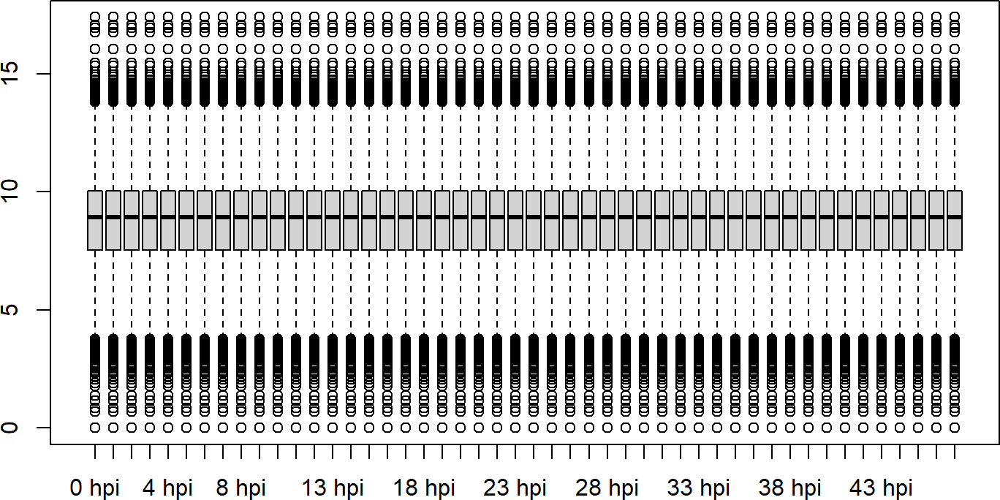
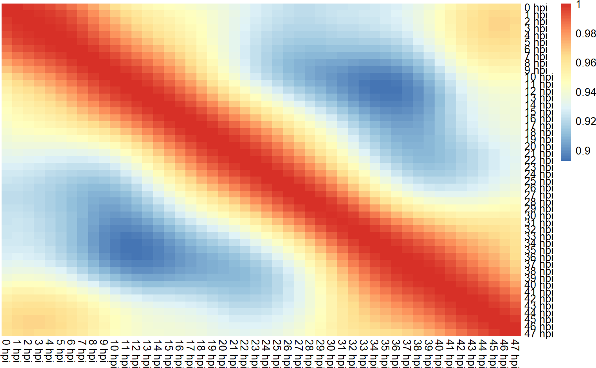

# Microarray data reanalysis

Abstract

This section covers examplary code on how one can reanalyze microarray
data of Apicomplexans (here Plasmodium as an example).

## Introduction

This vignette covers the example on how users can reanalyze the
Microarray data sets by updating the annotations from VEuPathDB
partially using
[`toGeneid()`](https://rohit-satyam.github.io/plasmoRUtils/reference/toGeneid.md)
and other R packages. It is important to do reanalysis before deciding
to reuse such dataset as annotations evolve since it will affect the
outcome of the analysis.

## Importing the dataset

``` r

## Loading necessary libraries
library(GEOquery)      # Querying the dataset from GEO
library(plasmoRUtils)  # For gene ID conversion
library(Biostrings)    # For sequence alignment
library(GenomicRanges) # For handling genomic coordinates
library(dplyr)         # For data wrangling
library(GeneStructureTools) # to remove the gene/transcript versions
```

For demonstration purpose, we will use `GSE66669` from ([Painter et al.
2018](#ref-painter2018genome)). This is a time-series dataset that is
often used by *Plasmodium* community to annotate single cell atlas and
deconvolution tasks.

The `getGEO` function retrieves the Microarray dataset as
*ExpressionSet* object from GEO database. We will make a new column by
combining the Old Ids and the probe sequence since we know that there
can be multiple sequence for one probe ID and same probe ID for multiple
genes.

``` r

gse <- getGEO("GSE66669")
gse <- gse$GSE66669_series_matrix.txt.gz
class(gse)
#> [1] "ExpressionSet"
#> attr(,"package")
#> [1] "Biobase"
dim(gse) ## 14499 rows and 144 samples
#> Features  Samples 
#>    14499      144
featureNames(gse) %>% head() ## The features are ID number.
#> [1] "4" "5" "6" "7" "8" "9"
## probe information is stored in 
probedf <- fData(gse)
head(probedf)
#>   ID COL ROW                NAME CONTROL_TYPE ACCESSION_STRING       ORF
#> 4  4  96 158  PFL0815W_v7.1_P1/3        FALSE         PFL0815w  PFL0815w
#> 5  5  96 156  PFB0495W_v7.1_P3/4        FALSE         PFB0495w  PFB0495w
#> 6  6  96 154 PF13_0050_v7.1_P1/4        FALSE        PF13_0050 PF13_0050
#> 7  7  96 152 PF14_0416_v7.1_P1/2        FALSE        PF14_0416 PF14_0416
#> 8  8  96 150 PF11_0120_v7.1_P1/1        FALSE        PF11_0120 PF11_0120
#> 9  9  96 148  PFI1280C_v7.1_P5/9        FALSE         PFI1280c  PFI1280c
#>   CHROMOSOMAL_LOCATION                                    DESCRIPTION
#> 4             unmapped                DNA-binding chaperone, putative
#> 5             unmapped conserved Plasmodium protein, unknown function
#> 6             unmapped                 HORMA domain protein, putative
#> 7             unmapped                  zinc finger protein, putative
#> 8             unmapped conserved Plasmodium protein, unknown function
#> 9             unmapped                       protein kinase, putative
#>                                                       SEQUENCE
#> 4 TGAGTGGATGTAATTTAATATGGTTAGATAAAGCAACCAAAAAGAGGAGCAAGGATATAT
#> 5 GAAAGTTTACAGAGTGAGTTTGAAAAAGTAACAAAAACTAGTAAAAAGGGAGGTATACAT
#> 6 AAACAAATGAATATCCACCTGAAAACAACCTTCTATTAAACAGTAACGATATATACCCTC
#> 7 AAAAAAGATAGTTTAGCAAAAAACAAATATACTGGGTTATATGGACCTGTACGTAGTAGT
#> 8 CGAATTATCATGGCCTTGAAAAATCATTAAGAAGACGAGGAGGTAAGATAAAAACTATTT
#> 9 CTTGTTGATTGTAACAACAGATCATTGATGAATAAAAATGTAATGGATTTTGCACATATG
#>               SPOT_ID
#> 4  PFL0815W_v7.1_P1/3
#> 5  PFB0495W_v7.1_P3/4
#> 6 PF13_0050_v7.1_P1/4
#> 7 PF14_0416_v7.1_P1/2
#> 8 PF11_0120_v7.1_P1/1
#> 9  PFI1280C_v7.1_P5/9

## There are 29 rows for which ORF entry is missing 
table(probedf$ACCESSION_STRING==probedf$ORF)
#> 
#> FALSE  TRUE 
#>    29 14470
probedf$ACCESSION_STRING[probedf$ACCESSION_STRING!=probedf$ORF]
#>  [1] "RNAzID:1537"      "RNAzID:3967"      "ScGlucanSynthase" "U5RNA"           
#>  [5] "ScGlucanSynthase" "RNAzID:2132"      "RNAzID:1876"      "ScGlucanSynthase"
#>  [9] "ScGlucanSynthase" "RNAzID:1678"      "ScCD"             "ScUPRT"          
#> [13] "S1-type_28S:rRNA" "ScGlucanSynthase" "ScGlucanSynthase" "ScGlucanSynthase"
#> [17] "ScGlucanSynthase" "ScGlucanSynthase" "tetR"             "RNAzID:1743"     
#> [21] "ScGlucanSynthase" "ScGlucanSynthase" "ScGlucanSynthase" "ScGlucanSynthase"
#> [25] "ScGlucanSynthase" "RNAzID:3370"      "ScGlucanSynthase" "Rluciferase"     
#> [29] "ScGlucanSynthase"
probedf$ORF[probedf$ACCESSION_STRING!=probedf$ORF]
#>  [1] "" "" "" "" "" "" "" "" "" "" "" "" "" "" "" "" "" "" "" "" "" "" "" "" ""
#> [26] "" "" "" ""

## Let's make unique identifiers by combining the Accession_string and sequence for those probes for which toGeneid function will fail
gse@featureData@data$unique <- paste0(gse@featureData@data$SEQUENCE,":",gse@featureData@data$ACCESSION_STRING)
probedf <- fData(gse)
```

The row names matches the ID column. We can see that the old “PFL” ids
are present in the `ACCESSION_STRING` or `ORF` columns while the probe
sequences are present in `SEQUENCE` column. Some 29 rows contains some
*Plasmodium* ncRNAs (RNAzID), followed by several control probes (see
table below).

| Probe ID | What it Is | Purpose |
|----|----|----|
| **RNAzID:1537, 1678, 1743, 1876, 2132, 3370, 3967** | Predicted non-coding RNAs in the *Plasmodium* genome (identified by the RNAz algorithm) | To assay expression (or absence thereof) of structured ncRNAs—often used to explore regulatory RNAs or as negative controls when comparing to mRNA signals. |
| **U5RNA** | U5 small nuclear RNA | A core spliceosomal snRNA—serves as a housekeeping control for RNA integrity and normalization. |
| **S1-type_28S:rRNA** | A segment of 28S ribosomal RNA | Ribosomal RNA control for overall RNA loading and quality. |
| **ScGlucanSynthase** | *Saccharomyces cerevisiae* glucan synthase transcript | Spike-in control from yeastto: monitor labeling efficiency and hybridization consistency. |
| **ScCD** | *S. cerevisiae* cytosine deaminase | Another yeast spike-in for normalization across arrays. |
| **ScUPRT** | *S. cerevisiae* uracil phosphoribosyltransferase | Yeast spike-in control for detection sensitivity. |
| **tetR** | Bacterial tetracycline repressor | Exogenous control to check for cross-hybridization and labeling. |
| **Rluciferase** | Renilla luciferase | Reporter gene spike-in: assesses labeling and detection linearity. |

``` r

## Let's use toGeneid function to map most of the old gene IDs to new IDs
new <- toGeneid(inputid = unique(probedf$ACCESSION_STRING),from = "old",to = "ensembl") %>% 
  unique()

## Some old IDs might map to two or more new PF3D7 Ids. In such case we will remove them from new df and add them to unmapped IDs to resolve them using probe sequence pattern search
multimap <- table(new$`Previous ID(s)`)[table(new$`Previous ID(s)`)>1] %>% names() %>% unique()
new <- subset(new, !(`Previous ID(s)` %in% multimap))

## Check which IDs failed to map
unmappedids <- setdiff(probedf$ACCESSION_STRING,new$`Previous ID(s)`) %>% unique()
unmappedprobes_df <- subset(probedf, ACCESSION_STRING %in% unmappedids) %>% 
  .[,c("ACCESSION_STRING" ,"SEQUENCE","unique")] %>%
  unique()

## Merge the new Ids df with probedf
probedf <- S4Vectors::merge(probedf, new, all.x=TRUE, all.y=FALSE, by.x="ACCESSION_STRING", by.y="Previous ID(s)", sort=FALSE)
```

Now, we observe that 130 probes failed to map using `toGeneid` function.
This would now require us to map the probe sequence to mRNA sequences to
figure out which gene the probes belongs to. Since these probe sequences
are short and 60 bp long, we can perform pattern search using
[`Biostrings::vmatchPattern()`](https://rdrr.io/pkg/Biostrings/man/matchPattern.html).
Below we will use `max.mismatch=0` in order to identify exact sequence
and avoid false positives. However, you can increase the mismatches if a
lot sequences fails to map.

``` r

## retriving mRNA from plasmoDB
mrna_fasta <- readDNAStringSet("https://plasmodb.org/common/downloads/release-68/Pfalciparum3D7/fasta/data/PlasmoDB-68_Pfalciparum3D7_AnnotatedTranscripts.fasta")

## Simplifying the transcript IDs by removing descriptions
names(mrna_fasta) <- stringr::str_split(names(mrna_fasta), pattern = "[ ]", n = 2, simplify = T)[, 1]

## we will use sequences to name the list because there are cases where the gene such as PFC0590c have more than two probes but they map to transcripts from different genes
probe_matches_zero <- lapply(unmappedprobes_df$SEQUENCE, function(seq) {
  vmatchPattern(seq, mrna_fasta, max.mismatch = 0) 
}) %>% setNames(unmappedprobes_df$unique)

## Checking if the unique column strings are actually unique or not
unique(unmappedprobes_df$unique) %>% length()
#> [1] 279

## The function above will return empty IRanges for those transcripts for which there was no match found
## So let's filter them

zero <- sapply(probe_matches_zero, function(x) names(mrna_fasta)[lengths(x) > 0])

## Removing the versions from transcript IDs to convert them to gene IDs. This df will be smaller than unmappedprobes_df because some sequence match will not return any hits
zero <- sapply(zero, function(x) unique(removeVersion(x))) %>% 
  plyr::ldply(.,.fun = rbind) %>% ## Convert list to df 
  unique()

zero %>% head()
#>                                                                         .id
#> 1  TTTACATCAGAAAATGACATCATAAATGAAGAGAAGAGAAAAAGCAAAAATAACTTGTGC:PF14_0788-c
#> 2   TCAAAACATCAAGAGAACAAATAAATATATACAATGCACCGAAAGGAATCATAAGGGGAA:PFL0825c-a
#> 3    AAGGCACAGATGATTTACGACATCATAATTCTAATACTACGGATTATAGTGGTTATAGTA:PF10_0161
#> 4  TAATAAAACCCGAACCAATAAATACAGACAATGATAAAACTAGTAGACTGGTAGAAAGCT:PF10_0168-a
#> 5   GCTAGTGCATCATGTATGACTGCATGTTTACAAGTATTTATAGAAAAAGGAATGAGTTTT:mal_mito_1
#> 6 GTTTTCTTTGAAGTGACACAGGTTCGATTCCGCGTCCTTGAGTTTCTGAGATAAAAAGTT:Pfa_snoR_42a
#>                1             2             3
#> 1  PF3D7_1404600          <NA>          <NA>
#> 2  PF3D7_1217100          <NA>          <NA>
#> 3  PF3D7_1016500          <NA>          <NA>
#> 4  PF3D7_1017300          <NA>          <NA>
#> 5 PF3D7_MIT01400          <NA>          <NA>
#> 6  PF3D7_0115050 PF3D7_0601800 PF3D7_0800650

## Sanity check if ID column has any duplicates
table(zero$.id)[table(zero$.id)>1]
#> named integer(0)

## Combine these results with probedf
probedf <- S4Vectors::merge(probedf, zero[,c(1,2)], all.x=TRUE, all.y=FALSE, by.x="unique", by.y=".id", sort=FALSE)
probedf$`Gene ID`[is.na(probedf$`Gene ID`)] <- probedf$`1`[is.na(probedf$`Gene ID`)]
probedf <- probedf %>% select(-`1`, -unique)

## The sequences that failed to map are either control genes or genes that have been removed from the annotations
probedf$ACCESSION_STRING[is.na(probedf$`Gene ID`)] %>% unique()
#>  [1] "eGFP_mut2"        "MAL1_ITS2"        "MAL7P1.142"       "Fluciferase"     
#>  [5] "ScGlucanSynthase" "tetR"             "DsRed"            "ScCD"            
#>  [9] "Pfa_snoR_37"      "PF13TR006"        "ScUPRT"           "Rluciferase"     
#> [13] "neoR"             "PF11_0033"        "RNAzID:1743"      "BSD"             
#> [17] "CsA"              "RNAzID:3370"      "MAL1_ITS1"        "Mp_rRNA"         
#> [21] "FKBP"             "PF14TR004"        "RNAzID:1876"      "MAL7_ITS1"       
#> [25] "RNAzID:3967"      "MAL5_ITS1"        "HsDHFR"           "mCherry"

## We will replace the missing Gene IDs with their previous accessions.
gse@featureData@data$`Gene ID`[is.na(gse@featureData@data$`Gene ID`)] <- gse@featureData@data$ACCESSION_STRING[is.na(gse@featureData@data$`Gene ID`)] 
rownames(probedf) <- probedf$ID
```

Since we used zero mismatches, ideally the probe sequence should match
with only one gene IDs (even if it maps to multiple transcripts of same
gene me remove the version from transcript IDs so we have 1 probe to 1
gene mapping). However, there could be causes where the probe sequence
maps without any mismatch to multiple locations. Such ids will have hits
in column `2` and `3`. One such probe is `Pfa_snoR_42a` which
confidently maps with `PF3D7_0601800`, `PF3D7_0115050` and
`PF3D7_0800650`. We confirm this with BlastN as well in PlasmoDB. All
these three genes codes for small nucleolar RNA but are present on `6`,
`1` and `8` chromosome respectively. Since chromosomal information is
absent from `probedf`, we can’t say for sure which gene this probe
represents. So we will use first hit and assign it to `PF3D7_0115050`

## Updating the feature data in the Expression set

We will now use limma’s `avereps` function to get the average values per
gene ID.

``` r

gse@featureData@data  <- probedf[rownames(gse@featureData@data),]

## retriving the intensity matrix
matrix <- assayData(gse)$exprs
library(limma)
probes2genes <- fData(gse)$`Gene ID` %>% setNames(fData(gse)$ID)

gene.mat <- avereps(matrix, ID=probes2genes, method="median")

gene.mat %>% head() %>% .[,1:5]
#>               GSM1627532 GSM1627533 GSM1627534 GSM1627535 GSM1627536
#> PF3D7_1216900  4929.1199  4901.7775  4846.6257  4753.3563  4619.9623
#> PF3D7_0211100   321.2292   324.0473   326.6416   329.4834   335.1214
#> PF3D7_1309400   740.9756   752.7146   766.7923   783.4820   801.7903
#> PF3D7_1443800  1029.0478  1049.5709  1069.6907  1090.2481  1107.5859
#> PF3D7_1111400  1418.8720  1390.1635  1367.5520  1351.4528  1335.2197
#> PF3D7_0926100  2274.6915  2224.1830  2177.2646  2130.5968  2085.8498
```

## Checking correlation between samples of time series data

This GSE series contains 3 time-series condition:

1.  Total RNA reflects the combined pool of transcripts in the cell at
    each timepoint, ( similar to standard RNA-seq.)

2.  Labeled (transcribed) captures only nascent RNA from the 10 min 4-TU
    pulse (a snapshot of transcription rate). For some reason Malaria
    Cell Atlas people use this.

3.  Unlabeled (stabilized) captures the pre-existing pool not labeled
    during the pulse (a proxy for RNA stability/turnover).

For more details read [Nascent in vivo mRNA labeling and capture
throughout the
IDC](https://pmc.ncbi.nlm.nih.gov/articles/PMC6037754/#Sec12) section of
the paper.

``` r

temp <- gse[,gse$characteristics_ch1.2=="sample type: Total RNA"]
matrix <- assayData(temp)$exprs
gene.mat <- avereps(matrix, ID=probes2genes, method="mean")
gene.mat <- gene.mat[!(is.na(rownames(gene.mat))),] ## Some rows names have NA i don't know why!!
## Remove control genes
gene.mat <- gene.mat[grepl("PF3D7",rownames(gene.mat)),]
colnames(gene.mat) <- temp$`time (hours post invasion):ch1`

gene.mat <- log2(normalizeQuantiles(gene.mat) + 1)

boxplot(gene.mat)
```



``` r

coormat <- cor(gene.mat)
pheatmap::pheatmap(coormat, cluster_rows = F, cluster_cols = F, border_color = NA)
```



For labeled data

``` r

temp <- gse[,gse$characteristics_ch1.2=="sample type: 4-TU Labeled RNA"]
matrix <- assayData(temp)$exprs
gene.mat <- avereps(matrix, ID=probes2genes, method="mean")
gene.mat <- gene.mat[!(is.na(rownames(gene.mat))),] ## Some rows names have NA i don't know why!!
gene.mat <- gene.mat[grepl("PF3D7",rownames(gene.mat)),]
colnames(gene.mat) <- temp$`time (hours post invasion):ch1`
gene.mat <- log2(normalizeQuantiles(gene.mat) + 1)
boxplot(gene.mat)
```



``` r

coormat <- cor(gene.mat)
pheatmap::pheatmap(coormat, cluster_rows = F, cluster_cols = F, border_color = NA)
```



## Session Info

``` r

utils::sessionInfo()
#> R version 4.4.1 (2024-06-14 ucrt)
#> Platform: x86_64-w64-mingw32/x64
#> Running under: Windows 11 x64 (build 26200)
#> 
#> Matrix products: default
#> 
#> 
#> locale:
#> [1] LC_COLLATE=English_India.utf8  LC_CTYPE=English_India.utf8   
#> [3] LC_MONETARY=English_India.utf8 LC_NUMERIC=C                  
#> [5] LC_TIME=English_India.utf8    
#> 
#> time zone: Asia/Riyadh
#> tzcode source: internal
#> 
#> attached base packages:
#> [1] stats4    stats     graphics  grDevices utils     datasets  methods  
#> [8] base     
#> 
#> other attached packages:
#>  [1] limma_3.60.6              GeneStructureTools_1.24.0
#>  [3] dplyr_1.2.1               GenomicRanges_1.56.2     
#>  [5] Biostrings_2.72.1         GenomeInfoDb_1.40.1      
#>  [7] XVector_0.44.0            IRanges_2.38.1           
#>  [9] S4Vectors_0.42.1          plasmoRUtils_1.1.1       
#> [11] rlang_1.3.0               readr_2.2.0              
#> [13] janitor_2.2.1             GEOquery_2.72.0          
#> [15] Biobase_2.64.0            BiocGenerics_0.50.0      
#> [17] BiocStyle_2.32.1         
#> 
#> loaded via a namespace (and not attached):
#>   [1] R.methodsS3_1.8.2                  dichromat_2.0-0.1                 
#>   [3] vroom_1.7.1                        progress_1.2.3                    
#>   [5] vsn_3.72.0                         nnet_7.3-20                       
#>   [7] vctrs_0.7.3                        digest_0.6.39                     
#>   [9] png_0.1-9                          proxy_0.4-29                      
#>  [11] MSnbase_2.30.1                     deldir_2.0-4                      
#>  [13] parallelly_1.48.0                  MASS_7.3-65                       
#>  [15] pkgdown_2.2.0                      reshape2_1.4.5                    
#>  [17] foreach_1.5.2                      withr_3.0.3                       
#>  [19] xfun_0.59                          survival_3.8-6                    
#>  [21] memoise_2.0.1                      hexbin_1.28.5                     
#>  [23] mixtools_2.0.0.1                   systemfonts_1.3.2                 
#>  [25] ragg_1.5.2                         gtools_3.9.5                      
#>  [27] easyPubMed_3.1.6                   R.oo_1.27.1                       
#>  [29] Formula_1.2-5                      prettyunits_1.2.0                 
#>  [31] KEGGREST_1.44.1                    promises_1.5.0                    
#>  [33] otel_0.2.0                         httr_1.4.8                        
#>  [35] restfulr_0.0.17                    globals_0.19.1                    
#>  [37] rstudioapi_0.19.0                  UCSC.utils_1.0.0                  
#>  [39] generics_0.1.4                     base64enc_0.1-6                   
#>  [41] processx_3.9.0                     curl_7.1.0                        
#>  [43] ncdf4_1.24                         zlibbioc_1.50.0                   
#>  [45] ScaledMatrix_1.12.0                randomForest_4.7-1.2              
#>  [47] bio3d_2.4-5                        GenomeInfoDbData_1.2.12           
#>  [49] SparseArray_1.4.8                  xtable_1.8-8                      
#>  [51] stringr_1.6.0                      desc_1.4.3                        
#>  [53] doParallel_1.0.17                  evaluate_1.0.5                    
#>  [55] S4Arrays_1.4.1                     BiocFileCache_2.12.0              
#>  [57] preprocessCore_1.66.0              hms_1.1.4                         
#>  [59] bookdown_0.47                      irlba_2.3.7                       
#>  [61] colorspace_2.1-2                   filelock_1.0.3                    
#>  [63] magrittr_2.0.5                     snakecase_0.11.1                  
#>  [65] later_1.4.8                        viridis_0.6.5                     
#>  [67] lattice_0.22-9                     MsCoreUtils_1.16.1                
#>  [69] future.apply_1.20.2                SparseM_1.84-2                    
#>  [71] XML_3.99-0.23                      scuttle_1.14.0                    
#>  [73] matrixStats_1.5.0                  class_7.3-23                      
#>  [75] Hmisc_5.2-6                        pillar_1.11.1                     
#>  [77] nlme_3.1-169                       iterators_1.0.14                  
#>  [79] compiler_4.4.1                     beachmat_2.20.0                   
#>  [81] stringi_1.8.7                      gower_1.0.2                       
#>  [83] SummarizedExperiment_1.34.0        dendextend_1.19.1                 
#>  [85] lubridate_1.9.5                    GenomicAlignments_1.40.0          
#>  [87] drawProteins_1.24.0                plyr_1.8.9                        
#>  [89] crayon_1.5.3                       abind_1.4-8                       
#>  [91] BiocIO_1.14.0                      bit_4.6.0                         
#>  [93] chromote_0.5.1                     pcaMethods_1.96.0                 
#>  [95] codetools_0.2-20                   textshaping_1.0.5                 
#>  [97] recipes_1.3.3                      BiocSingular_1.20.0               
#>  [99] MLInterfaces_1.84.0                bslib_0.11.0                      
#> [101] e1071_1.7-17                       biovizBase_1.52.0                 
#> [103] plotly_4.12.0                      LaplacesDemon_16.1.8              
#> [105] MultiAssayExperiment_1.30.3        splines_4.4.1                     
#> [107] Rcpp_1.1.2                         dbplyr_2.6.0                      
#> [109] sparseMatrixStats_1.16.0           interp_1.1-6                      
#> [111] knitr_1.51                         blob_1.3.0                        
#> [113] clue_0.3-68                        mzR_2.38.0                        
#> [115] AnnotationFilter_1.28.0            fs_2.1.0                          
#> [117] checkmate_2.3.4                    QFeatures_1.14.2                  
#> [119] listenv_1.0.0                      mzID_1.42.0                       
#> [121] DelayedMatrixStats_1.26.0          Gviz_1.48.0                       
#> [123] tibble_3.3.1                       Matrix_1.7-5                      
#> [125] statmod_1.5.2                      tzdb_0.5.0                        
#> [127] lpSolve_5.6.23                     pheatmap_1.0.13                   
#> [129] pkgconfig_2.0.3                    tools_4.4.1                       
#> [131] cachem_1.1.0                       BSgenome.Mmusculus.UCSC.mm10_1.4.3
#> [133] RSQLite_3.53.3                     viridisLite_0.4.3                 
#> [135] rvest_1.0.5                        DBI_1.3.0                         
#> [137] impute_1.78.0                      fastmap_1.2.0                     
#> [139] rmarkdown_2.31                     scales_1.4.0                      
#> [141] grid_4.4.1                         gt_1.3.0                          
#> [143] Rsamtools_2.20.0                   sass_0.4.10                       
#> [145] coda_0.19-4.1                      FNN_1.1.4.1                       
#> [147] BiocManager_1.30.27                VariantAnnotation_1.50.0          
#> [149] graph_1.82.0                       SingleR_2.6.0                     
#> [151] rpart_4.1.27                       farver_2.1.2                      
#> [153] yaml_2.3.12                        AnnotationForge_1.46.0            
#> [155] latticeExtra_0.6-31                MatrixGenerics_1.16.0             
#> [157] foreign_0.8-91                     rtracklayer_1.64.0                
#> [159] cli_3.6.6                          purrr_1.2.2                       
#> [161] txdbmaker_1.0.1                    lifecycle_1.0.5                   
#> [163] caret_7.0-1                        mvtnorm_1.4-1                     
#> [165] backports_1.5.1                    lava_1.9.2                        
#> [167] kernlab_0.9-33                     BiocParallel_1.38.0               
#> [169] annotate_1.82.0                    timechange_0.4.0                  
#> [171] gtable_0.3.6                       rjson_0.2.23                      
#> [173] parallel_4.4.1                     pROC_1.19.0.1                     
#> [175] jsonlite_2.0.0                     bitops_1.0-9                      
#> [177] ggplot2_4.0.3                      bit64_4.8.2                       
#> [179] pRoloc_1.44.1                      jquerylib_0.1.4                   
#> [181] segmented_2.2-1                    R.utils_2.13.0                    
#> [183] timeDate_4052.112                  lazyeval_0.2.3                    
#> [185] htmltools_0.5.9                    affy_1.82.0                       
#> [187] GO.db_3.19.1                       rappdirs_0.3.4                    
#> [189] ensembldb_2.28.1                   glue_1.8.1                        
#> [191] httr2_1.2.3                        RCurl_1.98-1.19                   
#> [193] MALDIquant_1.22.3                  mclust_6.1.3                      
#> [195] BSgenome_1.72.0                    jpeg_0.1-11                       
#> [197] gridExtra_2.3.1                    igraph_2.3.3                      
#> [199] R6_2.6.1                           tidyr_1.3.2                       
#> [201] SingleCellExperiment_1.26.0        GenomicFeatures_1.56.0            
#> [203] cluster_2.1.8.2                    stringdist_0.9.17                 
#> [205] ipred_0.9-15                       DelayedArray_0.30.1               
#> [207] tidyselect_1.2.1                   ProtGenerics_1.36.0               
#> [209] htmlTable_2.5.0                    sampling_2.11                     
#> [211] xml2_1.6.0                         AnnotationDbi_1.66.0              
#> [213] future_1.70.0                      ModelMetrics_1.2.2.2              
#> [215] rsvd_1.0.5                         S7_0.2.2                          
#> [217] affyio_1.74.0                      topGO_2.56.0                      
#> [219] data.table_1.18.4                  websocket_1.4.4                   
#> [221] mgsub_2.0.0                        htmlwidgets_1.6.4                 
#> [223] RColorBrewer_1.1-3                 biomaRt_2.60.1                    
#> [225] hardhat_1.4.3                      prodlim_2026.03.11                
#> [227] PSMatch_1.8.0
```

## References

Painter, Heather J, Neo Christopher Chung, Aswathy Sebastian, Istvan
Albert, John D Storey, and Manuel Llinás. 2018. “Genome-Wide Real-Time
in Vivo Transcriptional Dynamics During Plasmodium Falciparum
Blood-Stage Development.” *Nature Communications* 9 (1): 2656.
