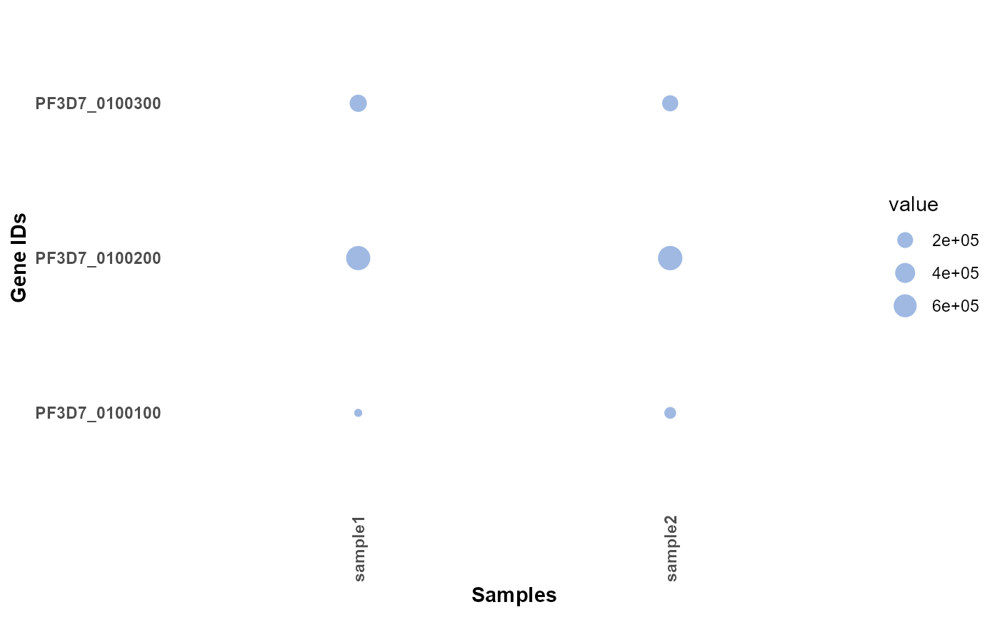
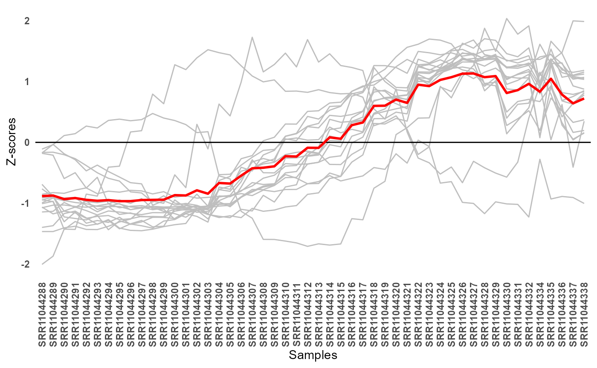
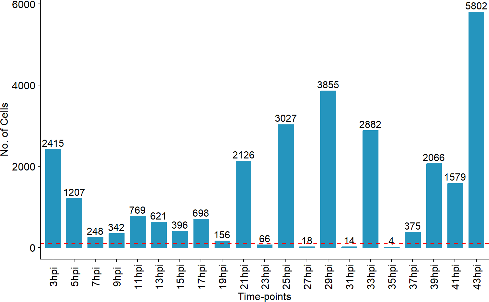
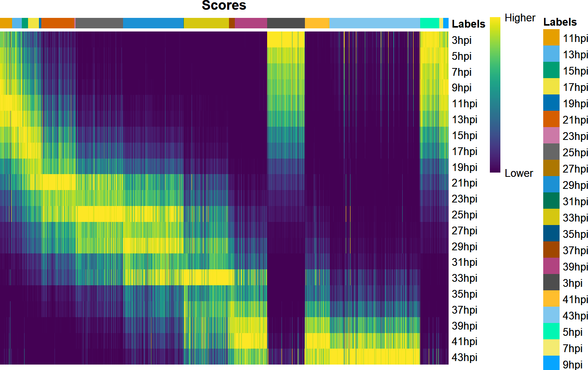
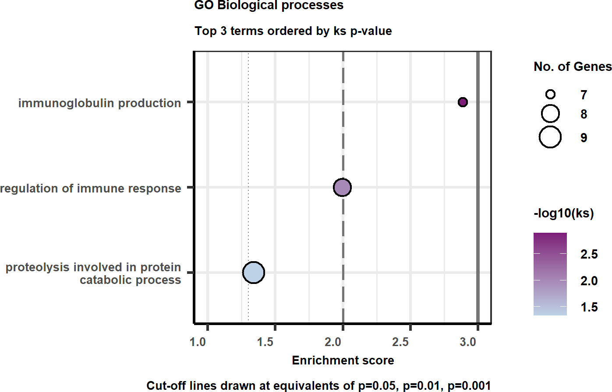
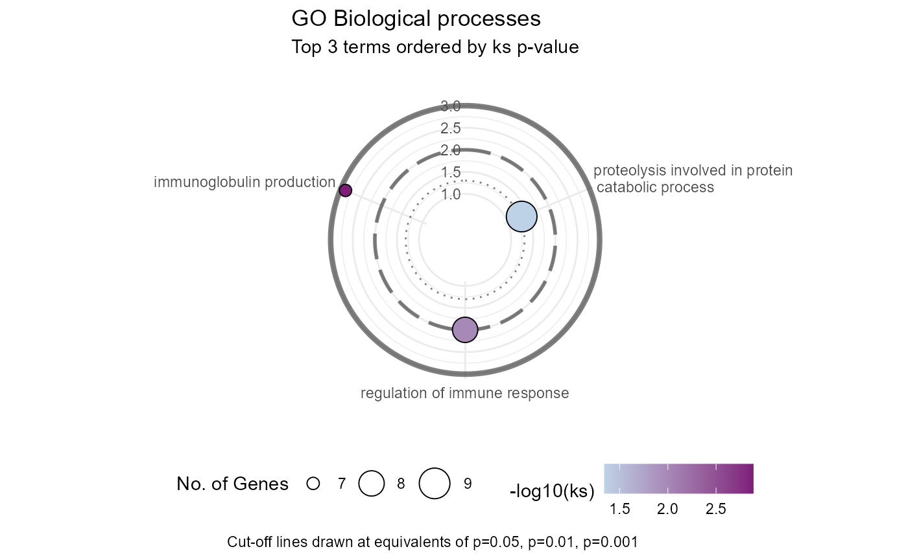

# Other useful functions

Abstract

This section covers the capability of plasmoRUtils to carry out other
mundane bioinformatics tasks.

## Introduction

Other than search functions, the *plasmoRUtils* package offers various
other functions that are routinely needed when performing bioinformatics
analysis. Their usage is discussed below.

``` r

# Load package and some other useful packages by using
suppressPackageStartupMessages(
  suppressWarnings({
    library(plasmoRUtils)
    library(dplyr)
    library(plyr)
    library(tibble)}))
```

### Making OrgDb and TxDb objects

For non-model organism, using R packages such as
*[clusterProfiler](https://bioconductor.org/packages/3.19/clusterProfiler)*
for enrichment analysis requires org.db packages. Unfortunately, this
requires ability to understand and use
*[AnnotationDbi](https://bioconductor.org/packages/3.19/AnnotationDbi)*
package. To make development of such packages quickly, we wrote a
wrapper function that instantly creates a TAR file that can be used and
shared by the user in no time.

``` r

## List organism you are interested in making org.db package from VEuPathDB.
## Use the links from PlasmoDB directly or provide locally saved GFF and GAF files.

## Get taxonomy ID using listVeupathdb(c("primary_key","ncbi_tax_id"))

easymakeOrgdb(
  gff =
    "https://plasmodb.org/common/downloads/release-68/Pfalciparum3D7/gff/data/PlasmoDB-68_Pfalciparum3D7.gff",
  gaf =
    "https://plasmodb.org/common/downloads/release-68/Pfalciparum3D7/gaf/PlasmoDB-68_Pfalciparum3D7_Curated_GO.gaf.gz",
  out.dir = ".",
  taxid = 36329,
  genus = "Plasmodium",
  sp = "falciparum3D7",
  version = 0.1,
  verbose = FALSE,
  maintainer = "John doe <johndoe@gmail.com>" ## Your name if you are maintaining it.
)

## Once the package is ready, one can use clusterProfiler as follows

library(clusterProfiler)
library(org.Pfalciparum3D7.eg.db)


ego <- enrichGO(gene          = genes,
                universe      = bkg_genes,
                OrgDb         = org.Pfalciparum3D7.eg.db,
                keyType = "GID",
                ont           = "BP",
                minGSSize=3,
                pAdjustMethod = "BH",
                pvalueCutoff  = 0.05,
                qvalueCutoff  = 0.05,
        readable      = FALSE)
```

The function above will create an org.db tar file which can be installed
and loaded to be used with
*[clusterProfiler](https://bioconductor.org/packages/3.19/clusterProfiler)*.

Similarly, if users want to make TxDb object in R to use other R
packages such as *[gDNAx](https://bioconductor.org/packages/3.19/gDNAx)*
used to access the genomic DNA contamination, they can do so easily
using
[`easyTxDbmaker()`](https://rohit-satyam.github.io/plasmoRUtils/reference/easyTxDbmaker.md)
function.

``` r

txdb<-easyTxDbmaker(
 gff="https://toxodb.org/common/downloads/release-68/TgondiiME49/gff/data/ToxoDB-68_TgondiiME49.gff",
 fasta="https://toxodb.org/common/downloads/release-68/TgondiiME49/fasta/data/ToxoDB-68_TgondiiME49_Genome.fasta",
 abbr="TgondiiME49",
 taxid=508771,org = "Toxoplasma gondii ME49",
 db = "ToxoDB release 68")
```

### Other easy functions

Users are also provided with easy functions which are wrapper functions
around routinely used to analyze bioinformatics data.

#### TPM normalization and visualization

In this section we will see how we can calculate effective gene lengths
from a GFF file followed by TPM normalization and visualize the
resulting normalized matrix. These functions are provided since most of
the RNASeq data present on VEuPathDb is TPM normalized and therefore
make it easy to plot the database procured values alongside your own
samples.

``` r


# To calculate the effective length of the genes you can use the following function
baseurl <- "https://plasmodb.org/common/downloads/release-68/"
getEffLen(paste0(baseurl,
"Pfalciparum3D7/gff/data/PlasmoDB-68_Pfalciparum3D7.gff")) %>% head()
#> # A tibble: 6 × 2
#>   GeneID        Length
#>   <chr>          <dbl>
#> 1 PF3D7_0100100   6492
#> 2 PF3D7_0100200    996
#> 3 PF3D7_0100300   3984
#> 4 PF3D7_0100400   1119
#> 5 PF3D7_0100500    112
#> 6 PF3D7_0100600   1080
```

The above function returns a dataframe which can be fed to the
[`easyTPM()`](https://rohit-satyam.github.io/plasmoRUtils/reference/easyTPM.md)
function alongside the count matrix. The function also adds the
effective length as a column at the end so that people can find it easy
to convert the values to the raw counts. This is also helpful since the
exon-intron boundaries are always evolving as the new data-sets become
available.

``` r

library(ggplot2)
## Generating dummy effective length for quick demonstration
gene_info <- data.frame(GeneID = c("PF3D7_0100100", "PF3D7_0100200", "PF3D7_0100300"), Length = c(6492, 996, 3984))

## Making a dummy count matrix
count_matrix <- matrix(c(10, 20, 30, 40, 50, 60),
                       nrow = 3, ncol = 2,
                       dimnames = list(c("PF3D7_0100100", "PF3D7_0100200", "PF3D7_0100300"), c("sample1", "sample2"))
                       )

## TPM normalization
test <- easyTPM(count_matrix, gene_info) %>% rownames_to_column(var = "GeneID")

## TPM visualization as a bubble plot
df <- reshape2::melt(test[,-ncol(test)],na.rm = T)
easyExpPlot(df,x="variable",y="GeneID",value="value", type = "bubble")+labs(x="Samples",y="Gene IDs")
```



You can also plot normalized expression data as line plot if you have
cluster of genes with similar pattern of expression. To demonstrate this
we will use a subset of genes from ([Subudhi et al.
2020](#ref-Subudhi2020)) time series dataset. We will perform TPM
normalization, followed by log transformation and eventually use the
Z-scores for visualization.

``` r


data("subudhi2020")
count_matrix <- subudhi2020@assays@data$counts
baseurl <- "https://plasmodb.org/common/downloads/release-68/"
gene_info <- getEffLen(paste0(baseurl,"Pfalciparum3D7/gff/data/PlasmoDB-68_Pfalciparum3D7.gff"))

normalised <- easyTPM(count_matrix, gene_info) 

## Since normalized matrix have effective gene length column at the end
logTransformed = log2(normalised[,-ncol(normalised)] + 1)

## Get z-scores
z.mat <- t(scale(t(logTransformed), scale=TRUE, center=TRUE)) %>% as.data.frame() %>% rownames_to_column(var = "GeneID")

## Subsetting few genes of interest
gois <- c("PF3D7_1476300","PF3D7_0220800","PF3D7_0936200","PF3D7_0402200","PF3D7_1401600","PF3D7_0831600","PF3D7_0204100","PF3D7_1458300","PF3D7_0935800","PF3D7_0929400","PF3D7_1439000","PF3D7_0905400","PF3D7_1334600","PF3D7_1121300","PF3D7_0302500","PF3D7_1232800","PF3D7_0310400","PF3D7_1001600")

## Transforming data frame for visualisation
df <- z.mat %>% 
  subset(.,GeneID %in% gois) %>% 
  reshape2::melt(.,na.rm = T)

easyExpPlot(df,x="variable",y="value",value="GeneID")+
  labs(y="Z-scores",x="Samples")
```



[`easyExpPlot()`](https://rohit-satyam.github.io/plasmoRUtils/reference/easyExpPlot.md)
can be used to plot expression values obtained from any kind of applied
normalization and transformation.

#### Support for NOISeq `readData` function for non-model organism

When using *[NOISeq](https://bioconductor.org/packages/3.19/NOISeq)* for
QC, users are often required to provide various information alongside
count matrices. These information includes biotype, chromosome, gc
content, length of the features etc. These arguments are listed as
optional but are required by
*[NOISeq](https://bioconductor.org/packages/3.19/NOISeq)* package for
making QC plots. To enable users to get these information from the same
reference FASTA file and GFF file used by user for alignment, we wrote
[`easyNOISeqAnnot()`](https://rohit-satyam.github.io/plasmoRUtils/reference/easyNOISeqAnnot.md)
function that enable users to quickly get this information from GTF/GFF
file and FASTA file and return a data frame. These can be provided as a
URL or as locally stored files.

``` r

gene_info <- easyNOISeqAnnot(
 gff="https://toxodb.org/common/downloads/release-68/EpraecoxHoughton/gff/data/ToxoDB-68_EpraecoxHoughton.gff",
 fasta = "https://toxodb.org/common/downloads/release-68/EpraecoxHoughton/fasta/data/ToxoDB-68_EpraecoxHoughton_Genome.fasta")

gene_info %>% head()
#>                 gene_id   gene_biotype        gc
#> EPH_0000010 EPH_0000010 protein_coding 0.5329587
#> EPH_0000020 EPH_0000020 protein_coding 0.4712575
#> EPH_0000030 EPH_0000030 protein_coding 0.5618822
#> EPH_0000040 EPH_0000040 protein_coding 0.5624426
#> EPH_0000050 EPH_0000050 protein_coding 0.4910354
#> EPH_0000060 EPH_0000060 protein_coding 0.5811796
#>                                                                    desc length
#> EPH_0000010 Helicase associated domain HA2 containing protein , related   6584
#> EPH_0000020                      DNA polymerase alpha subunit, putative   5010
#> EPH_0000030                                        hypothetical protein   2529
#> EPH_0000040                             hypothetical protein, conserved   6534
#> EPH_0000050                             hypothetical protein, conserved   4462
#> EPH_0000060                             hypothetical protein, conserved   1509
#>             starts  ends      chr
#> EPH_0000010   2602  9185 HG688746
#> EPH_0000020  50573 55582 HG688746
#> EPH_0000030    101  2629 HG695046
#> EPH_0000040  19822 26355 HG697798
#> EPH_0000050  30217 34678 HG697798
#> EPH_0000060  36161 37669 HG697798
```

You can now pass the data frame contents to
[`NOISeq::readData()`](https://rdrr.io/pkg/NOISeq/man/readData.html)
function as follows.

``` r

data_NOISEQ <- NOISeq::readData(data = counts,
                        length=setNames(gene_info$length, gene_info$gene_id),
                        gc=setNames(gene_info$gc, gene_info$gene_id),
                        biotype=setNames(gene_info$gene_biotype, gene_info$gene_id),
                        chromosome = gene_info[,c("chr","starts","ends")],
                        factors = meta)
```

#### Check synchronization of Bulk RNASeq samples using `easyLabelTransfer()`

[`easyLabelTransfer()`](https://rohit-satyam.github.io/plasmoRUtils/reference/easyLabelTransfer.md)
is a wrapper function written around
*[SingleR](https://bioconductor.org/packages/3.19/SingleR)*
[`SingleR()`](https://rdrr.io/pkg/SingleR/man/SingleR.html) function to
quickly use count matrices from Bulk/ Single cell Reference data sets to
check synchronization (time point and stage) of the Parasite Bulk RNASeq
samples and can be used for QC purposes.

Here, for demonstration purpose, we will use single cell RNASeq data
from Malaria Cell Atlas and use ([Subudhi et al.
2020](#ref-Subudhi2020)) Bulk time-series dataset to transfer labels and
see the distribution of the cells across different time points.

Other data sets provided with the package includes:

- Time course Microarray dataset of *P. falciparum* 3D7 from ([Painter
  et al. 2018](#ref-painter2018genome)): `data("painter2018")`
- Time course Bulk RNASeq (Single-end) of *P. falciparum* 3D7 from
  ([Toenhake et al. 2018](#ref-toenhake2018chromatin)):
  `data("toenhake2018")`
- Time course Bulk RNASeq (Paired-end) of *P. falciparum* 3D7 from
  ([Kucharski et al. 2020](#ref-Kucharski2020)): `data("kucharski2020")`
- Reanalyzed scRNAseq of *T. gondii* ME49 data from ([Lou et al.
  2024](#ref-lou2024single)): `data("gubbels2024")`
- Reanalyzed scRNAseq of *T. gondii* ME49 data from ([Xue et al.
  2020](#ref-xue2020single)): `data("boothroyd2020")`
- Reanalyzed Bulk RNASeq (Paired-end) of *P. falciparum* 3D7 from
  ([Wichers et al. 2019](#ref-Wichers2019)): `data("wichers2019")`

Next, Malaria cell atlas (MCA) is a database comprising of single cell
data sets and can be accessed using the following functions.

1.  [`listMCA()`](https://rohit-satyam.github.io/plasmoRUtils/reference/listMCA.md)
    function enables you to filter and list scRNASeq data sets for which
    data download links are available. User can use this function to
    view a table to metadata about the dataset or download these
    datasets recursively rather than manually downloading single dataset
    at a time.
2.  [`easyMCA()`](https://rohit-satyam.github.io/plasmoRUtils/reference/easyMCA.md)
    enables users to import the count matrix and metadata directly in
    the R environment directly. Written mainly for pipeline development.

Now, lets use the function enlisted above alongside
[`easyLabelTransfer()`](https://rohit-satyam.github.io/plasmoRUtils/reference/easyLabelTransfer.md)
as shown below.

> Note: The output obtained from
> [`easyLabelTransfer()`](https://rohit-satyam.github.io/plasmoRUtils/reference/easyLabelTransfer.md)
> function is a DFrame object and can be fed to other SingleR functions
> for visual purposes.

``` r

library(SingleR)
set.seed(12458)
## Fetching the URL
mcalist <- listMCA()
data("subudhi2020") ## reference dataset
subudhi2020 <- subudhi2020[,1:42] ## Skipping samples after 43 Hpi since they highly correlate with 43hpi itself.

## Using this reference set
url <- "https://www.malariacellatlas.org/downloads/pf-ch10x-set4-biorxiv.zip"

raw_counts <- easyMCA(url,type = "raw")
rownames(raw_counts) <- gsub("-","_",rownames(raw_counts))
meta <- easyMCA(url,type="data")

## Retaining only Asexual stage cells and Lab isolates.
meta <- subset(meta, meta$STAGE_LR %in% c("ring","trophozoite","schizont") & DAY != "Field")
raw_counts <- raw_counts[,rownames(meta)]

## Filtering away field isolates and sexual stage cells

labels <- easyLabelTransfer(queryCounts = raw_counts,
                            refCounts = subudhi2020@assays@data$counts, referenceMeta = subudhi2020@colData, labelCol = "timetag", isrefBulk = TRUE)

table(labels$pruned.labels)
#> 
#> 11hpi 13hpi 15hpi 17hpi 19hpi 21hpi 23hpi 25hpi 27hpi 29hpi 31hpi 33hpi 35hpi 
#>   762   615   396   698   155  2126    65  3027    18  3855    14  2882     3 
#> 37hpi 39hpi  3hpi 41hpi 43hpi  5hpi  7hpi  9hpi 
#>   375  2066  2361  1579  5727  1199   241   336

df <- labels$labels %>% table() %>% data.frame()
df$. <- factor(df$., levels = subudhi2020$timetag %>% unique())

ggpubr::ggbarplot(df,x=".",y="Freq", label = TRUE, color = "#2595be", fill = "#2595be")+
  geom_hline(yintercept = 100,colour = "red", linetype=2 )+
  labs(x="Time-points",y="No. of Cells")+
  theme(axis.text.x = element_text(angle = 90, vjust = 0.5))
```



``` r


plotScoreHeatmap(labels,show_colnames = F,
                       show.pruned = F, 
                       cluster_cols = F, 
                       cluster_rows = FALSE, 
                       rows.order=unique(subudhi2020$timetag))
```



You can see that cells from some time points are underrepresented in our
Malaria Cell Atlas.

#### GO Enrichment using `easytopGO()`

VEuPathDB constituent database allow users to perform GO Enrichment
analysis. However, there is no option to set the background genes and by
default all the genes in the are used. This is not an ideal approach.
Moreover, since Gene Ontologies are curated using different pipelines by
different enrichment providers, the results might differ just based on
source of Ontologies. Similarly the Ontology data might not be available
in other databases such as BioMart and you would like to use custom GAF
file.

Users of parasite domain might wish to use GAF files provided by
VEuPathDB constituent database and of specific genome assembly as per
their hypothesis. To enable users to do that, GO enrichment analysis can
be performed easily and quickly using our
[`easytopGO()`](https://rohit-satyam.github.io/plasmoRUtils/reference/easytopGO.md)
wrapper function. This function requires users to provide a named
numeric vector, where names are Ensembl Gene IDs and numeric vector
could be adjusted p-values. Users can also supply genes to be used as
background using `bkggset` argument. Finally users can use `gaf`
argument to supply .gaf file obtained from VEuPathDBs constituent
database of interest.

For well known organisms, Biomart Ontologies can also be used. In such
case user has to provide `mart` argument and figure out key for emsembl
gene IDs . However, many times the parasite assemblies used as reference
by Ensembl might not match with parasite assembly used by VEuPathDB. In
such cases there might be mismatches between gene IDs (see one such
issue [here](https://github.com/Huber-group-EMBL/biomaRt/issues/110)).

You can also change `category` argument to specify which GO category you
want to test enrichment for. Since for most of the parasites,
sub-cellular localization and Molecular function information is
sparingly available, “BP” has been set as the default.

Finally, you can also use ORA results obtained from VEuPathDBs as input
to
[`easytopGO()`](https://rohit-satyam.github.io/plasmoRUtils/reference/easytopGO.md).

``` r

# Making a numeric vector of padjusted values
gois <- c("PF3D7_0102200","PF3D7_0207400","PF3D7_0207500","PF3D7_0207600","PF3D7_0207700","PF3D7_0207800","PF3D7_0207900","PF3D7_0208000","PF3D7_0404700","PF3D7_0501500","PF3D7_0502400","PF3D7_0618000","PF3D7_0731800","PF3D7_0930300","PF3D7_1116000","PF3D7_1247800","PF3D7_1334700")


p_values <- c(1.767929e-49,3.886063e-148,6.459285e-269,0.000000e+00,6.842121e-132,
5.282318e-178,1.140221e-224,1.625665e-100,6.177129e-08,1.484155e-03,2.789648e-10,2.300720e-12,7.450697e-30,3.417972e-89,4.846689e-73,1.207966e-11,4.173777e-51)
names(p_values) <- gois

## Using all genes captured as a background

background.gset <- rownames(subudhi2020@assays@data$counts)
baseurl <- "https://plasmodb.org/common/downloads/Current_Release/"
url<-paste0(baseurl,"Pfalciparum3D7/gaf/PlasmoDB-68_Pfalciparum3D7_GO.gaf.gz")

## Performing ORA
gores<-easytopGO(geneID = p_values,useGAF = TRUE,useBiomart = FALSE,gaf=url,
bkggset = background.gset, category = "BP", stats = "ks")

## Plotting the results. 
goplt <- easyGOPlot(gores, title = "GO Biological processes", limit = 20, sortby = "ks")
goplt
```



``` r


## Making circular plot
goplt+theme_minimal()+coord_radial(inner.radius = 0.3, rotate.angle = TRUE,r_axis_inside = TRUE)+ylab("")+ggeasy::easy_legend_at("bottom")
```



The
[`easyGOPlot()`](https://rohit-satyam.github.io/plasmoRUtils/reference/easyGOPlot.md)
is adapted and modified version of what has been provided by [Kevin
Blighe](https://www.biostars.org/p/471549/) on Biostars. You can use
`limit` argument to limit number of terms to be plotted.

#### Screening the Signal Peptides from PDBs

We also offer a convenient function,
[`easyAF2Signal()`](https://rohit-satyam.github.io/plasmoRUtils/reference/easyAF2Signal.md),
to diagnose potential false-positive signal peptides using SignalP
predictions from the VEuPathDB database and AlphaFold2 structures, based
on an observational study conducted by ([Sanaboyana and Elcock
2024](#ref-Sanaboyana2024)). The authors found that true N-terminal
signal peptides (~24-24 amino acids) are typically disengaged from the
protein body and lack atomic contacts, and AlphaFold2 attempts to model
them in a similar way.

[`easyAF2Signal()`](https://rohit-satyam.github.io/plasmoRUtils/reference/easyAF2Signal.md)
is an R equivalent with slight modifications to the Fortran code
provided by the authors, which reports additional information, such as
the number of residues remaining after pLDDT filtering.

We did this modification because, if all the signal peptide residues
have low pLDDT scores and are filtered out, no residues will remain to
calculate contacts with the protein body, resulting in zero contacts.
This could give a false impression that the first 25 amino acids are
signal peptides, but it cannot be confirmed, as the zero-contact
observed is due to no residues remaining after filtering, not because
the signal peptide was disengaged from the protein body.

``` r


easyAF2Signal("https://alphafold.ebi.ac.uk/files/AF-A0A140KXW6-F1-model_v6.pdb")
#>                        Name length_signalpeptide length_protein
#> 1 AF-A0A140KXW6-F1-model_v6                   25            410
#>   postbfacFiltered_signalP_res medianSignalP_bfac clevagesite_bfac
#> 1                           16              92.19            94.25
#>   postbfacFiltered_rest_res medianRest_bfac res_res_conts atm_atm_conts
#> 1                       284           93.91            65           242
```

In the example above, we see that signal peptide has low mean pLDDT
score and therefore there are no residues left post filtering of bad
quality residues leading to zero residue-residue counts `res_res_conts`.
Thus we can’t say for sure if the PDB in hand have signal peptide or
not.

## Session Info

``` r

sessionInfo()
#> R version 4.4.1 (2024-06-14 ucrt)
#> Platform: x86_64-w64-mingw32/x64
#> Running under: Windows 11 x64 (build 26200)
#> 
#> Matrix products: default
#> 
#> 
#> locale:
#> [1] LC_COLLATE=English_India.utf8  LC_CTYPE=English_India.utf8   
#> [3] LC_MONETARY=English_India.utf8 LC_NUMERIC=C                  
#> [5] LC_TIME=English_India.utf8    
#> 
#> time zone: Asia/Riyadh
#> tzcode source: internal
#> 
#> attached base packages:
#> [1] stats4    stats     graphics  grDevices utils     datasets  methods  
#> [8] base     
#> 
#> other attached packages:
#>  [1] topGO_2.56.0                SparseM_1.84-2             
#>  [3] GO.db_3.19.1                AnnotationDbi_1.66.0       
#>  [5] graph_1.82.0                SingleR_2.6.0              
#>  [7] SummarizedExperiment_1.34.0 Biobase_2.64.0             
#>  [9] GenomicRanges_1.56.2        GenomeInfoDb_1.40.1        
#> [11] IRanges_2.38.1              S4Vectors_0.42.1           
#> [13] BiocGenerics_0.50.0         MatrixGenerics_1.16.0      
#> [15] matrixStats_1.5.0           ggplot2_4.0.3              
#> [17] tibble_3.3.1                plyr_1.8.9                 
#> [19] dplyr_1.2.1                 plasmoRUtils_1.1.1         
#> [21] rlang_1.3.0                 readr_2.2.0                
#> [23] janitor_2.2.1               BiocStyle_2.32.1           
#> 
#> loaded via a namespace (and not attached):
#>   [1] segmented_2.2-1             fs_2.1.0                   
#>   [3] ProtGenerics_1.36.0         bitops_1.0-9               
#>   [5] lubridate_1.9.5             pRoloc_1.44.1              
#>   [7] httr_1.4.8                  RColorBrewer_1.1-3         
#>   [9] doParallel_1.0.17           tools_4.4.1                
#>  [11] MSnbase_2.30.1              R6_2.6.1                   
#>  [13] lazyeval_0.2.3              withr_3.0.3                
#>  [15] prettyunits_1.2.0           gridExtra_2.3.1            
#>  [17] preprocessCore_1.66.0       cli_3.6.6                  
#>  [19] textshaping_1.0.5           gt_1.3.0                   
#>  [21] sass_0.4.10                 mvtnorm_1.4-1              
#>  [23] S7_0.2.2                    randomForest_4.7-1.2       
#>  [25] proxy_0.4-29                pkgdown_2.2.0              
#>  [27] Rsamtools_2.20.0            systemfonts_1.3.2          
#>  [29] txdbmaker_1.0.1             AnnotationForge_1.46.0     
#>  [31] dichromat_2.0-0.1           parallelly_1.48.0          
#>  [33] limma_3.60.6                rstudioapi_0.19.0          
#>  [35] impute_1.78.0               RSQLite_3.53.3             
#>  [37] FNN_1.1.4.1                 generics_0.1.4             
#>  [39] BiocIO_1.14.0               gtools_3.9.5               
#>  [41] dendextend_1.19.1           Matrix_1.7-5               
#>  [43] MALDIquant_1.22.3           drawProteins_1.24.0        
#>  [45] abind_1.4-8                 lifecycle_1.0.5            
#>  [47] yaml_2.3.12                 snakecase_0.11.1           
#>  [49] recipes_1.3.3               SparseArray_1.4.8          
#>  [51] BiocFileCache_2.12.0        grid_4.4.1                 
#>  [53] blob_1.3.0                  promises_1.5.0             
#>  [55] crayon_1.5.3                PSMatch_1.8.0              
#>  [57] lattice_0.22-9              beachmat_2.20.0            
#>  [59] GenomicFeatures_1.56.0      annotate_1.82.0            
#>  [61] chromote_0.5.1              mzR_2.38.0                 
#>  [63] KEGGREST_1.44.1             pillar_1.11.1              
#>  [65] knitr_1.51                  rjson_0.2.23               
#>  [67] lpSolve_5.6.23              future.apply_1.20.2        
#>  [69] codetools_0.2-20            mgsub_2.0.0                
#>  [71] glue_1.8.1                  pcaMethods_1.96.0          
#>  [73] data.table_1.18.4           MultiAssayExperiment_1.30.3
#>  [75] vctrs_0.7.3                 png_0.1-9                  
#>  [77] gtable_0.3.6                kernlab_0.9-33             
#>  [79] cachem_1.1.0                gower_1.0.2                
#>  [81] xfun_0.59                   prodlim_2026.03.11         
#>  [83] S4Arrays_1.4.1              coda_0.19-4.1              
#>  [85] survival_3.8-6              ncdf4_1.24                 
#>  [87] timeDate_4052.112           SingleCellExperiment_1.26.0
#>  [89] iterators_1.0.14            hardhat_1.4.3              
#>  [91] lava_1.9.2                  statmod_1.5.2              
#>  [93] MLInterfaces_1.84.0         ipred_0.9-15               
#>  [95] nlme_3.1-169                bit64_4.8.2                
#>  [97] progress_1.2.3              filelock_1.0.3             
#>  [99] LaplacesDemon_16.1.8        bslib_0.11.0               
#> [101] affyio_1.74.0               irlba_2.3.7                
#> [103] rpart_4.1.27                otel_0.2.0                 
#> [105] colorspace_2.1-2            DBI_1.3.0                  
#> [107] nnet_7.3-20                 tidyselect_1.2.1           
#> [109] processx_3.9.0              bit_4.6.0                  
#> [111] compiler_4.4.1              curl_7.1.0                 
#> [113] rvest_1.0.5                 httr2_1.2.3                
#> [115] xml2_1.6.0                  desc_1.4.3                 
#> [117] DelayedArray_0.30.1         plotly_4.12.0              
#> [119] bookdown_0.47               rtracklayer_1.64.0         
#> [121] scales_1.4.0                hexbin_1.28.5              
#> [123] affy_1.82.0                 rappdirs_0.3.4             
#> [125] stringr_1.6.0               digest_0.6.39              
#> [127] mixtools_2.0.0.1            rmarkdown_2.31             
#> [129] XVector_0.44.0              htmltools_0.5.9            
#> [131] pkgconfig_2.0.3             sparseMatrixStats_1.16.0   
#> [133] dbplyr_2.6.0                fastmap_1.2.0              
#> [135] htmlwidgets_1.6.4           UCSC.utils_1.0.0           
#> [137] DelayedMatrixStats_1.26.0   farver_2.1.2               
#> [139] jquerylib_0.1.4             jsonlite_2.0.0             
#> [141] BiocParallel_1.38.0         mclust_6.1.3               
#> [143] mzID_1.42.0                 ModelMetrics_1.2.2.2       
#> [145] BiocSingular_1.20.0         RCurl_1.98-1.19            
#> [147] magrittr_2.0.5              scuttle_1.14.0             
#> [149] GenomeInfoDbData_1.2.12     Rcpp_1.1.2                 
#> [151] viridis_0.6.5               MsCoreUtils_1.16.1         
#> [153] vsn_3.72.0                  pROC_1.19.0.1              
#> [155] stringi_1.8.7               zlibbioc_1.50.0            
#> [157] MASS_7.3-65                 listenv_1.0.0              
#> [159] parallel_4.4.1              Biostrings_2.72.1          
#> [161] splines_4.4.1               hms_1.1.4                  
#> [163] igraph_2.3.3                QFeatures_1.14.2           
#> [165] reshape2_1.4.5              biomaRt_2.60.1             
#> [167] ScaledMatrix_1.12.0         XML_3.99-0.23              
#> [169] evaluate_1.0.5              BiocManager_1.30.27        
#> [171] tzdb_0.5.0                  foreach_1.5.2              
#> [173] tidyr_1.3.2                 purrr_1.2.2                
#> [175] future_1.70.0               clue_0.3-68                
#> [177] bio3d_2.4-5                 rsvd_1.0.5                 
#> [179] xtable_1.8-8                restfulr_0.0.17            
#> [181] AnnotationFilter_1.28.0     easyPubMed_3.1.6           
#> [183] e1071_1.7-17                later_1.4.8                
#> [185] viridisLite_0.4.3           class_7.3-23               
#> [187] ragg_1.5.2                  websocket_1.4.4            
#> [189] memoise_2.0.1               GenomicAlignments_1.40.0   
#> [191] cluster_2.1.8.2             globals_0.19.1             
#> [193] timechange_0.4.0            caret_7.0-1                
#> [195] sampling_2.11
```

## References

Kucharski, Michal, Jaishree Tripathi, Sourav Nayak, et al. 2020. “A
Comprehensive RNA Handling and Transcriptomics Guide for High-Throughput
Processing of Plasmodium Blood-Stage Samples.” *Malaria Journal* 19 (1).
<https://doi.org/10.1186/s12936-020-03436-w>.

Lou, Jingjing, Yasaman Rezvani, Argenis Arriojas, et al. 2024. “Single
Cell Expression and Chromatin Accessibility of the Toxoplasma Gondii
Lytic Cycle Identifies AP2XII-8 as an Essential Ribosome Regulon
Driver.” *Nature Communications* 15 (1): 7419.

Painter, Heather J, Neo Christopher Chung, Aswathy Sebastian, Istvan
Albert, John D Storey, and Manuel Llinás. 2018. “Genome-Wide Real-Time
in Vivo Transcriptional Dynamics During Plasmodium Falciparum
Blood-Stage Development.” *Nature Communications* 9 (1): 2656.

Sanaboyana, Venkata R., and Adrian H. Elcock. 2024. “Improving Signal
and Transit Peptide Predictions Using AlphaFold2-Predicted Protein
Structures.” *Journal of Molecular Biology* 436 (2): 168393.
<https://doi.org/10.1016/j.jmb.2023.168393>.

Subudhi, Amit K., Aidan J. O’Donnell, Abhinay Ramaprasad, et al. 2020.
“Malaria Parasites Regulate Intra-Erythrocytic Development Duration via
Serpentine Receptor 10 to Coordinate with Host Rhythms.” *Nature
Communications* 11 (1). <https://doi.org/10.1038/s41467-020-16593-y>.

Toenhake, Christa Geeke, Sabine Anne-Kristin Fraschka, Mahalingam
Shanmugiah Vijayabaskar, David Robert Westhead, Simon Jan van Heeringen,
and Richárd Bártfai. 2018. “Chromatin Accessibility-Based
Characterization of the Gene Regulatory Network Underlying Plasmodium
Falciparum Blood-Stage Development.” *Cell Host & Microbe* 23 (4):
557–69.

Wichers, J. Stephan, Judith A. M. Scholz, Jan Strauss, et al. 2019.
“Dissecting the Gene Expression, Localization, Membrane Topology, and
Function of the Plasmodium Falciparum STEVOR Protein Family.” *mBio* 10
(4). <https://doi.org/10.1128/mbio.01500-19>.

Xue, Yuan, Terence C Theisen, Suchita Rastogi, Abel Ferrel, Stephen R
Quake, and John C Boothroyd. 2020. “A Single-Parasite Transcriptional
Atlas of Toxoplasma Gondii Reveals Novel Control of Antigen Expression.”
*Elife* 9: e54129.
