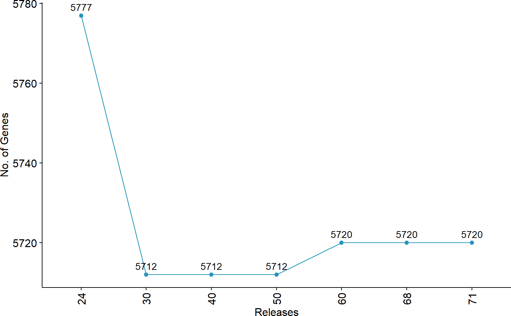
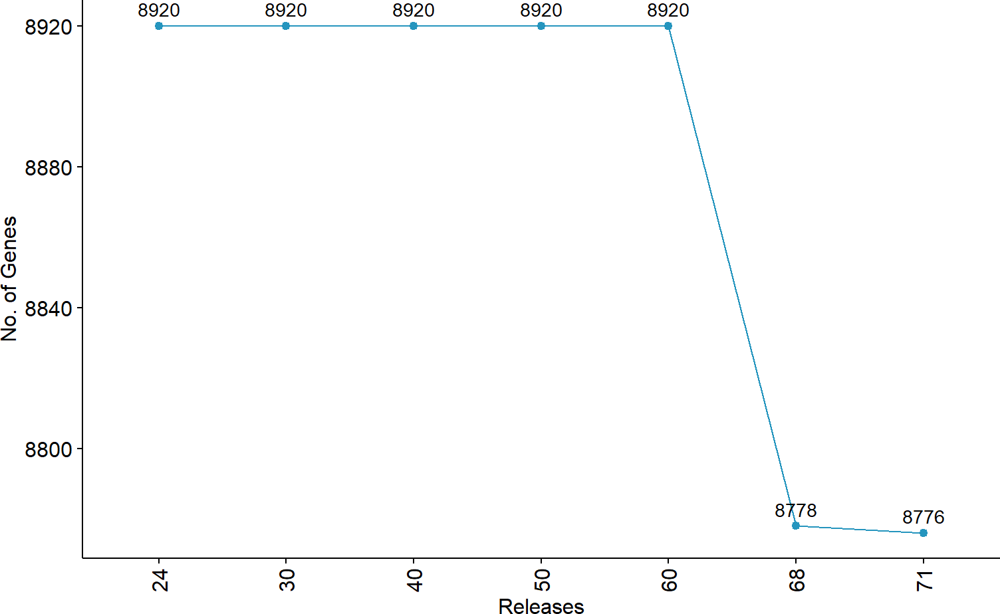
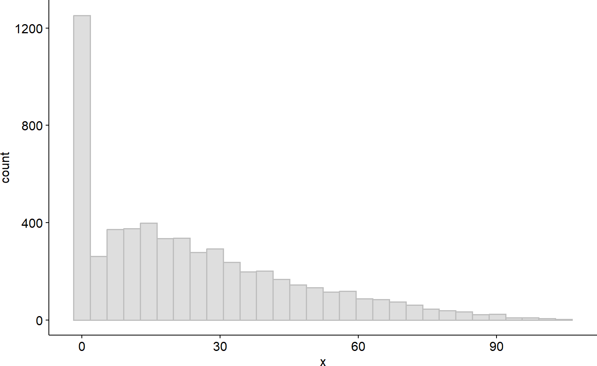
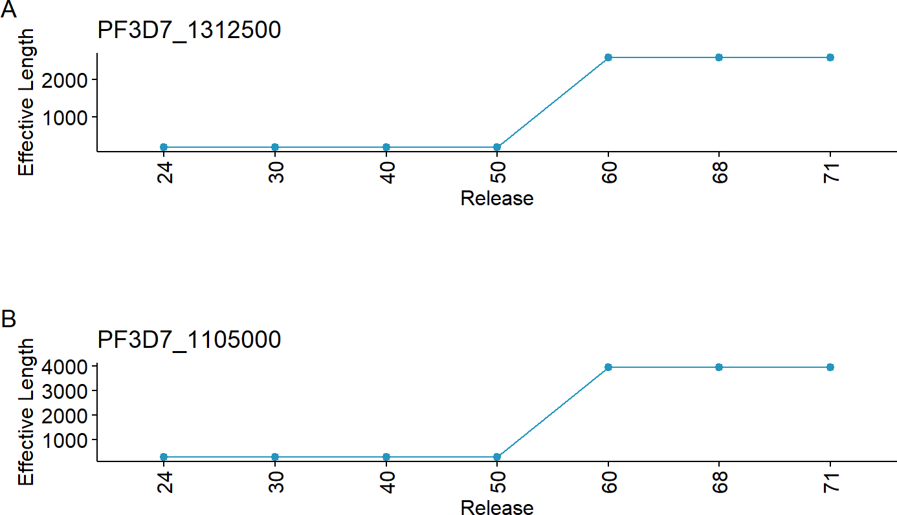
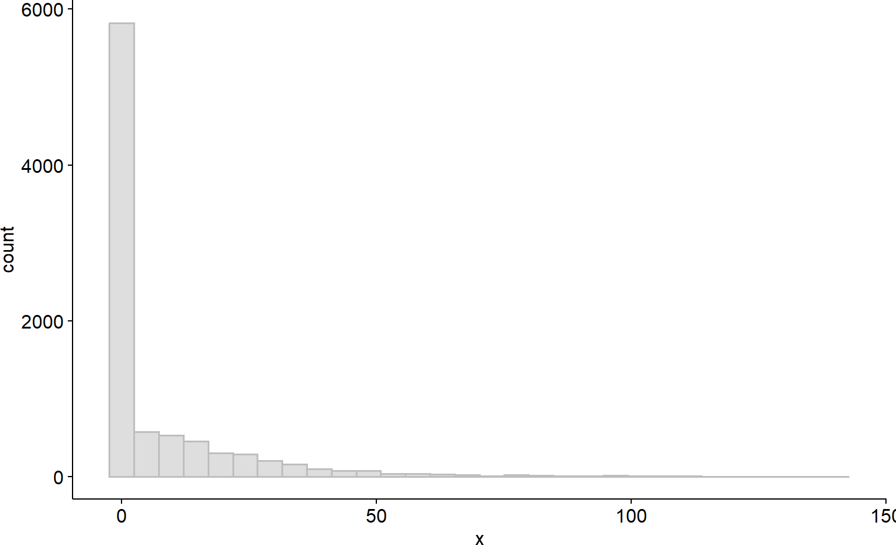
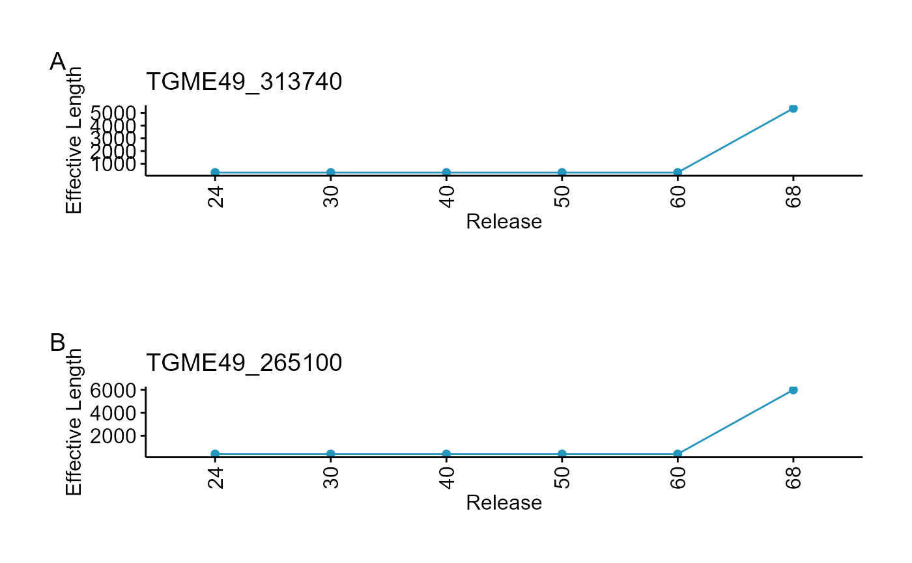

# RNASeq: Need for reanalysis?

Abstract

This section examines how annotations evolve across successive VEuPathDB
releases. As exon–intron boundaries are continually refined with
incoming sequencing data, tracking shifts in effective gene length
enables users to decide whether existing published datasets warrant
reanalysis based on the magnitude of those changes.

## Introduction

In the bioinformatics community, it is common to reuse published RNA-seq
count or normalized count data without reprocessing, often overlooking
important technical differences such as the version of genome
annotation. Assembly updates typically include revisions to:

- **GFF files**, where gene models and exon‐intron structures are
  updated, UTRs redefined etc.
- **GAF files**, where GO terms are revised based on newly published
  evidence

For RNA-seq, these updates can substantially affect downstream analyses
(e.g., over-representation or pathway enrichment). These changes are
often documented in the **NEWS** sections of VEuPathDB.

For instance, in *Plasmodium* and *Toxoplasma*, two key assembly updates
were:

- [Release 51 (16 Mar
  2021)](https://plasmodb.org/plasmo/app/static-content/PlasmoDB/news.html#PlasmoDB51Released)
  for **PlasmoDB**
- [Release 66 (28 Nov
  2023)](https://toxodb.org/toxo/app/static-content/ToxoDB/news.html#ToxoDB66Released)
  for **ToxoDB**, which included extensive gene‐model revisions

From an RNA-seq perspective, here we will focus on two factors that are
known to affect biological outcomes and mappability. These include
changes in:

1.  **Number of Genes**
2.  **Exon‐intron boundaries:** Measured here as **effective gene
    length** (the sum of exon lengths)

In the example below, we will use *Plasmodium* and *Toxoplasma* releases
and the *plasmoRUtils* function
[`getEffLen()`](https://rohit-satyam.github.io/plasmoRUtils/reference/getEffLen.md)
to track how effective gene lengths hift across versions.

## Assessing Changes in Gene Number

We will compare six releases (`24, 30, 40, 50, 60, and 68`) for both
*Plasmodium* and *Toxoplasma*. From the NEWS section, we know that in
*Plasmodium*, several loci initially annotated as rRNAs, lncRNAs, or
coding genes were later removed, and the mitochondrial genome of PF3D7
was revised in [2019](https://pubmed.ncbi.nlm.nih.gov/31080894/).
Similarly, *Toxoplasma* TGME49 gene models underwent extensive updates
in release 66.

``` r

library(plasmoRUtils)
library(dplyr)
library(tidyr)
library(tibble)
library(ggpubr)
library(GeneStructureTools)
library(ggplot2)

releases <- c(24,30,40,50,60,68)

## Getching GFFs from PlasmoDB and calculating effective lengths
pf3d7.gffs <- lapply(releases, function(x){
 paste0("https://plasmodb.org/common/downloads/release-",x,"/Pfalciparum3D7/gff/data/PlasmoDB-",x,"_Pfalciparum3D7.gff") %>% getEffLen() 
}) %>% setNames(releases) 

## Getching GFFs from ToxoDB and calculating effective lengths
tgme49.gffs <- lapply(releases, function(x){
 paste0("https://toxodb.org/common/downloads/release-",x,"/TgondiiME49/gff/data/ToxoDB-",x,"_TgondiiME49.gff") %>% getEffLen() 
}) %>% setNames(releases)

## Let's plot changes in number of genes 
pf3d7.ngenes<- lapply(pf3d7.gffs, nrow)  %>% setNames(releases) %>% plyr::ldply()
tgme49.ngenes<- lapply(tgme49.gffs, nrow)  %>% setNames(releases) %>% plyr::ldply()

ggpubr::ggline(pf3d7.ngenes,x=".id",y="V1", label = TRUE, color = "#2595be", fill = "#2595be")+labs(x="Releases",y="No. of Genes")+theme(axis.text.x = element_text(angle = 90, vjust = 0.5))
```



``` r


ggpubr::ggline(tgme49.ngenes,x=".id",y="V1", label = TRUE, color = "#2595be", fill = "#2595be")+labs(x="Releases",y="No. of Genes")+theme(axis.text.x = element_text(angle = 90, vjust = 0.5))
```



For *Plasmodium*, the current release has 5720 genes. 57 genes have been
removed since Release 24. Similarly 142 genes have been removed from
*Toxoplasma* as compared to previous releases.

## Assessing the difference in Effective gene lengths

To get intuition about counts of which genes will be affected mostly, we
will calculate coefficient of variation where:

`CV = (Standard Deviation / Mean) × 100`

If the effective gene length of the gene didn’t change across releases,
the CV will be equal to zero. Similarly if the change in effective
length is major for a gene, the CV value will be higher. The CV also
gives us intuition about which genes underwent drastic changes; eg: a
100 bp change will matter more for a 200 bp gene than for a 5000 bp
gene.

We will calculate CV using following steps:

1.  Since gene IDs might vary across releases, we will first convert old
    Gene IDs to new gene IDs using
    [`toGeneid()`](https://rohit-satyam.github.io/plasmoRUtils/reference/toGeneid.md)
    and retain IDs which are common across all releases.
2.  In old annotations like release 24, some genes coding for multiple
    transcripts are present as separate gene entries each coding for 1
    transcripts often denoted by versions before them such as
    `PF3D7_0618900.1,F3D7_0618900.2`. This issue has been fixed in
    latest releases. To handle this we will remove the versions from
    gene IDs and take the average effective length for such genes.
3.  We will than calculate the CV and filter all the genes with CV\>0.

``` r

###  Step1
# Remove version suffix from GeneIDs
df <- pf3d7.gffs %>% plyr::ldply() %>%
  mutate(GeneID = GeneStructureTools::removeVersion(GeneID))

# Get annotation table and identify outdated IDs
annot <- getTable(org = "Plasmodium falciparum 3D7", db = "plasmodb")
old <- setdiff(unique(df$GeneID), annot$`Gene ID`) ## 152 old IDs

# Map outdated to Ensembl IDs
new_ids <- toGeneid(old, from = "old", to = "ensembl") %>%
  select(`Gene ID`, `Previous ID(s)`) %>%
  distinct() ## only 62 mapped

# Replace outdated IDs in df. These are mostly apicoplast genes
df$GeneID[match(new_ids$`Gene ID`,df$GeneID )] <- new_ids$`Gene ID`

# Filter for valid GeneIDs
subdf <- df %>%
  filter(GeneID %in% annot$`Gene ID`)

###  Step 2 
# Aggregate length per gene across releases
df_agg <- subdf %>%
  group_by(.id, GeneID) %>%
  summarise(mean_length = round(mean(Length, na.rm = TRUE)), .groups = "drop") %>%
  pivot_wider(names_from = GeneID, values_from = mean_length, values_fill = NA) %>%
  column_to_rownames(".id") %>%
  as.matrix()

###  Step 3
# Coefficient of variation across releases
cv <- apply(df_agg, 2, function(x) (sd(x, na.rm = TRUE) / mean(x, na.rm = TRUE)) * 100) %>%
  sort(decreasing = TRUE)

## How many genes have their effective exon length change >100 bp between versions 50 and 68
t(df_agg) %>% .[,c(4,6)] %>% data.frame() %>% dplyr::mutate("diff"=`X68`-`X50` > 100) %>% dplyr::pull(diff) %>% table()
#> .
#> FALSE  TRUE 
#>  1222  4437

## Check for how many genes the effective length has changed
table(cv>0) #4535 genes have their effective length changed
#> 
#> FALSE  TRUE 
#>  1185  4535
ggpubr::gghistogram(cv,color = "grey", fill = "grey")
```



``` r


## Let's filter top 20 genes whose effective length has changed drastically and see what they are

annot %>%
  select(`Gene ID`, `Product Description`) %>%
  distinct() %>%
  filter(`Gene ID` %in% names(cv)[1:20]) %>%
  column_to_rownames("Gene ID") %>%
  .[names(cv)[1:20], , drop = FALSE] %>%
  mutate(cv = cv[names(cv)[1:20]]) ## We see a lot of hypothetical genes
#>                                                Product Description       cv
#> PF3D7_1312500       conserved Plasmodium protein, unknown function 124.1221
#> PF3D7_1105000                                           histone H4 123.2382
#> PF3D7_1102800              early transcribed membrane protein 11.2 122.8477
#> PF3D7_1252300       conserved Plasmodium protein, unknown function 120.9319
#> PF3D7_1133000       conserved Plasmodium protein, unknown function 119.7104
#> PF3D7_0926200       conserved Plasmodium protein, unknown function 118.7044
#> PF3D7_0627000       conserved Plasmodium protein, unknown function 117.7699
#> PF3D7_0221800                                 hypothetical protein 117.3651
#> PF3D7_0624500      anaphase-promoting complex subunit 11, putative 117.0429
#> PF3D7_0202800       conserved Plasmodium protein, unknown function 116.1717
#> PF3D7_0936000                              ring-exported protein 2 114.3509
#> PF3D7_1003500                 40S ribosomal protein S20e, putative 113.8707
#> PF3D7_1325700       conserved Plasmodium protein, unknown function 113.8358
#> PF3D7_0817800     respiratory chain complex 3 associated protein 3 113.8013
#> PF3D7_0323000 translation machinery-associated protein 7, putative 113.3105
#> PF3D7_0530000       conserved Plasmodium protein, unknown function 112.0993
#> PF3D7_1202900                       high mobility group protein B1 112.0186
#> PF3D7_1355800               splicing factor 3B subunit 5, putative 111.9045
#> PF3D7_1102700              early transcribed membrane protein 11.1 111.8313
#> PF3D7_0705700                  40S ribosomal protein S29, putative 111.1493

# plot top 2 variable genes
plts <- names(cv)[1:2] %>%
  lapply(function(gid) {
    df %>%
      filter(GeneID == gid) %>%
      ggline(x = ".id", y = "Length",color = "#2595be", fill = "#2595be") +
      labs(title = gid, x = "Release", y = "Effective Length") +
      theme(axis.text.x = element_text(angle = 90, vjust = 0.5))
  })

library(sjPlot)
plot_grid(plts)
```



From the exploration above, we see a 79% of gene models have been
revised since release 50 and 78% of total has \>100 bp increment in
exonic region (4437). Therefore any published RNASeq dataset using
annotations older than Release 50 must be reanalysed since the read
counts are destined to change for these genes.

> If you are working on annotation of hypothetical genes, you should be
> cautious about which assembly you use since your gene might appear to
> be down regulated as per old annotation but this might change with
> change in the current annotation.

Let’s recycle the code above for *Toxoplasma*.

``` r

library(dplyr)
library(tidyr)
library(tibble)
library(ggpubr)
library(GeneStructureTools)

###  Step1
# Remove version suffix from GeneIDs
df <- tgme49.gffs %>% plyr::ldply() %>%
  mutate(GeneID = GeneStructureTools::removeVersion(GeneID))

# Get annotation table and identify outdated IDs
annot <- getTable(org = "Toxoplasma gondii ME49", db = "toxodb")
old <- setdiff(unique(df$GeneID), annot$`Gene ID`) ## 583 old IDs

# Map outdated to Ensembl IDs
new_ids <- toGeneid(old, from = "old", to = "ensembl", org = "Toxoplasma gondii ME49", db = "toxodb") %>%
  select(`Gene ID`, `Previous ID(s)`) %>%
  distinct() ## only 332 mapped

# Replace outdated IDs in df. These are mostly apicoplast genes
df$GeneID[match(new_ids$`Gene ID`,df$GeneID )] <- new_ids$`Gene ID`

# Filter for valid GeneIDs
subdf <- df %>%
  filter(GeneID %in% annot$`Gene ID`)

###  Step 2 
# Aggregate length per gene across releases
df_agg <- subdf %>%
  group_by(.id, GeneID) %>%
  summarise(mean_length = round(mean(Length, na.rm = TRUE)), .groups = "drop") %>%
  pivot_wider(names_from = GeneID, values_from = mean_length, values_fill = NA) %>%
  column_to_rownames(".id") %>%
  as.matrix()

###  Step 3
# Coefficient of variation across releases
cv <- apply(df_agg, 2, function(x) (sd(x, na.rm = TRUE) / mean(x, na.rm = TRUE)) * 100) %>%
  sort(decreasing = TRUE)

## How many genes have their effective exon length change >100 bp
t(df_agg) %>% .[,c(5,6)] %>% data.frame() %>% dplyr::mutate("diff"=`X68`-`X60` > 100) %>% dplyr::pull(diff) %>% table()
#> .
#> FALSE  TRUE 
#>  6341  1996

## Check for how many genes the effective length has changed
table(cv>0) #3390 genes have their effective length changed
#> 
#> FALSE  TRUE 
#>  4947  3390
ggpubr::gghistogram(cv,color = "grey", fill = "grey")
```



``` r


## Let's filter top 20 genes whose effective length has changed drastically and see what they are

annot %>%
  select(`Gene ID`, `Product Description`) %>%
  distinct() %>%
  filter(`Gene ID` %in% names(cv)[1:20]) %>%
  column_to_rownames("Gene ID") %>%
  .[names(cv)[1:20], , drop = FALSE] %>%
  mutate(cv = cv[names(cv)[1:20]]) ## We see a lot of hypothetical genes
#>                                                          Product Description
#> TGME49_313740               zinc finger (CCCH type) motif-containing protein
#> TGME49_265100                                           hypothetical protein
#> TGME49_288850                                           hypothetical protein
#> TGME49_245440                                           hypothetical protein
#> TGME49_223845                                           hypothetical protein
#> TGME49_313890                                           hypothetical protein
#> TGME49_231998                                           hypothetical protein
#> TGME49_291160                 dynein light polypeptide 4, axonemal, putative
#> TGME49_311820                                           hypothetical protein
#> TGME49_230135                                     Kinesin-associated protein
#> TGME49_209945                                           hypothetical protein
#> TGME49_254140                          DNA-directed RNA polymerase II RPABC4
#> TGME49_244890                                               cyclin, putative
#> TGME49_310177                                           hypothetical protein
#> TGME49_240790                                   dynein light chain, putative
#> TGME49_260825                                           hypothetical protein
#> TGME49_308830                           dual specificity protein phosphatase
#> TGME49_261470           U6 snRNA-associated Sm family protein LSm6, putative
#> TGME49_275750                    small nuclear ribonucleoprotein E, putative
#> TGME49_283470 Kazal-type serine protease inhibitor domain-containing protein
#>                     cv
#> TGME49_313740 178.6757
#> TGME49_265100 171.6388
#> TGME49_288850 161.6959
#> TGME49_245440 157.8947
#> TGME49_223845 152.1074
#> TGME49_313890 151.9148
#> TGME49_231998 146.3761
#> TGME49_291160 143.9601
#> TGME49_311820 134.4396
#> TGME49_230135 134.2367
#> TGME49_209945 129.9972
#> TGME49_254140 126.7883
#> TGME49_244890 125.7379
#> TGME49_310177 125.1441
#> TGME49_240790 121.8464
#> TGME49_260825 121.0684
#> TGME49_308830 120.6382
#> TGME49_261470 120.3902
#> TGME49_275750 119.9072
#> TGME49_283470 119.0964

# plot top 2 variable genes
plts <- names(cv)[1:2] %>%
  lapply(function(gid) {
    df %>%
      filter(GeneID == gid) %>%
      ggline(x = ".id", y = "Length",color = "#2595be", fill = "#2595be") +
      labs(title = gid, x = "Release", y = "Effective Length") +
      theme(axis.text.x = element_text(angle = 90, vjust = 0.5))
  })

library(sjPlot)
plot_grid(plts)
```



In this case 40% of the genes show change in effective length with 1996
proteins (23%) having exonic region expanision \>100 bp as compared to
past releases and this change happened after release 60 (Release 66 to
be precise but for brevity of vignette, we chose to use 60 and 68).

## Discussion

The scope of reannotation directly influences whether legacy datasets
remain reliable or must be reprocessed; such technical choices
inevitably affect downstream biological interpretations. We found that
majority of bulk transcriptomic studies (27 out of 38 datasets) for
*Plasmodium* in `PlasmoDB` relies on annotations predating release 51
and can benefit from reanalysis. Therefore, any analysis—be it
correlation, co‐expression, or single‐cell mapping—should use reanalyzed
data based on up‐to‐date GFFs. Given VEuPathDB’s constrained resources,
the reanalysis responsibility falls to the end users to regenerate and
share these reprocessed datasets whenever feasible.

## Session

``` r

sessionInfo()
#> R version 4.4.1 (2024-06-14 ucrt)
#> Platform: x86_64-w64-mingw32/x64
#> Running under: Windows 11 x64 (build 26200)
#> 
#> Matrix products: default
#> 
#> 
#> locale:
#> [1] LC_COLLATE=English_India.utf8  LC_CTYPE=English_India.utf8   
#> [3] LC_MONETARY=English_India.utf8 LC_NUMERIC=C                  
#> [5] LC_TIME=English_India.utf8    
#> 
#> time zone: Asia/Riyadh
#> tzcode source: internal
#> 
#> attached base packages:
#> [1] stats     graphics  grDevices utils     datasets  methods   base     
#> 
#> other attached packages:
#>  [1] sjPlot_2.9.0              GeneStructureTools_1.24.0
#>  [3] ggpubr_1.0.0              ggplot2_4.0.3            
#>  [5] tibble_3.3.1              tidyr_1.3.2              
#>  [7] dplyr_1.2.1               plasmoRUtils_1.1.1       
#>  [9] rlang_1.3.0               readr_2.2.0              
#> [11] janitor_2.2.1             BiocStyle_2.32.1         
#> 
#> loaded via a namespace (and not attached):
#>   [1] IRanges_2.38.1                     dichromat_2.0-0.1                 
#>   [3] vroom_1.7.1                        progress_1.2.3                    
#>   [5] vsn_3.72.0                         nnet_7.3-20                       
#>   [7] Biostrings_2.72.1                  vctrs_0.7.3                       
#>   [9] digest_0.6.39                      png_0.1-9                         
#>  [11] proxy_0.4-29                       MSnbase_2.30.1                    
#>  [13] deldir_2.0-4                       parallelly_1.48.0                 
#>  [15] MASS_7.3-65                        pkgdown_2.2.0                     
#>  [17] reshape2_1.4.5                     foreach_1.5.2                     
#>  [19] BiocGenerics_0.50.0                withr_3.0.3                       
#>  [21] xfun_0.59                          survival_3.8-6                    
#>  [23] memoise_2.0.1                      hexbin_1.28.5                     
#>  [25] mixtools_2.0.0.1                   systemfonts_1.3.2                 
#>  [27] ragg_1.5.2                         gtools_3.9.5                      
#>  [29] easyPubMed_3.1.6                   Formula_1.2-5                     
#>  [31] prettyunits_1.2.0                  KEGGREST_1.44.1                   
#>  [33] promises_1.5.0                     otel_0.2.0                        
#>  [35] httr_1.4.8                         rstatix_1.0.0                     
#>  [37] restfulr_0.0.17                    globals_0.19.1                    
#>  [39] rstudioapi_0.19.0                  UCSC.utils_1.0.0                  
#>  [41] generics_0.1.4                     base64enc_0.1-6                   
#>  [43] processx_3.9.0                     curl_7.1.0                        
#>  [45] ncdf4_1.24                         S4Vectors_0.42.1                  
#>  [47] zlibbioc_1.50.0                    ScaledMatrix_1.12.0               
#>  [49] randomForest_4.7-1.2               bio3d_2.4-5                       
#>  [51] GenomeInfoDbData_1.2.12            SparseArray_1.4.8                 
#>  [53] xtable_1.8-8                       stringr_1.6.0                     
#>  [55] desc_1.4.3                         doParallel_1.0.17                 
#>  [57] evaluate_1.0.5                     S4Arrays_1.4.1                    
#>  [59] BiocFileCache_2.12.0               preprocessCore_1.66.0             
#>  [61] hms_1.1.4                          GenomicRanges_1.56.2              
#>  [63] bookdown_0.47                      irlba_2.3.7                       
#>  [65] colorspace_2.1-2                   filelock_1.0.3                    
#>  [67] magrittr_2.0.5                     snakecase_0.11.1                  
#>  [69] later_1.4.8                        viridis_0.6.5                     
#>  [71] lattice_0.22-9                     MsCoreUtils_1.16.1                
#>  [73] future.apply_1.20.2                SparseM_1.84-2                    
#>  [75] XML_3.99-0.23                      scuttle_1.14.0                    
#>  [77] matrixStats_1.5.0                  Hmisc_5.2-6                       
#>  [79] class_7.3-23                       pillar_1.11.1                     
#>  [81] nlme_3.1-169                       iterators_1.0.14                  
#>  [83] compiler_4.4.1                     beachmat_2.20.0                   
#>  [85] stringi_1.8.7                      gower_1.0.2                       
#>  [87] SummarizedExperiment_1.34.0        dendextend_1.19.1                 
#>  [89] lubridate_1.9.5                    GenomicAlignments_1.40.0          
#>  [91] drawProteins_1.24.0                plyr_1.8.9                        
#>  [93] crayon_1.5.3                       abind_1.4-8                       
#>  [95] BiocIO_1.14.0                      bit_4.6.0                         
#>  [97] chromote_0.5.1                     pcaMethods_1.96.0                 
#>  [99] codetools_0.2-20                   textshaping_1.0.5                 
#> [101] recipes_1.3.3                      BiocSingular_1.20.0               
#> [103] MLInterfaces_1.84.0                bslib_0.11.0                      
#> [105] e1071_1.7-17                       biovizBase_1.52.0                 
#> [107] plotly_4.12.0                      LaplacesDemon_16.1.8              
#> [109] MultiAssayExperiment_1.30.3        splines_4.4.1                     
#> [111] Rcpp_1.1.2                         dbplyr_2.6.0                      
#> [113] sparseMatrixStats_1.16.0           interp_1.1-6                      
#> [115] knitr_1.51                         blob_1.3.0                        
#> [117] clue_0.3-68                        mzR_2.38.0                        
#> [119] AnnotationFilter_1.28.0            fs_2.1.0                          
#> [121] checkmate_2.3.4                    QFeatures_1.14.2                  
#> [123] listenv_1.0.0                      mzID_1.42.0                       
#> [125] DelayedMatrixStats_1.26.0          Gviz_1.48.0                       
#> [127] ggsignif_0.6.4                     Matrix_1.7-5                      
#> [129] statmod_1.5.2                      tzdb_0.5.0                        
#> [131] lpSolve_5.6.23                     pkgconfig_2.0.3                   
#> [133] tools_4.4.1                        cachem_1.1.0                      
#> [135] BSgenome.Mmusculus.UCSC.mm10_1.4.3 RSQLite_3.53.3                    
#> [137] viridisLite_0.4.3                  rvest_1.0.5                       
#> [139] DBI_1.3.0                          impute_1.78.0                     
#> [141] fastmap_1.2.0                      rmarkdown_2.31                    
#> [143] scales_1.4.0                       grid_4.4.1                        
#> [145] gt_1.3.0                           Rsamtools_2.20.0                  
#> [147] broom_1.0.13                       sass_0.4.10                       
#> [149] coda_0.19-4.1                      FNN_1.1.4.1                       
#> [151] BiocManager_1.30.27                VariantAnnotation_1.50.0          
#> [153] graph_1.82.0                       carData_3.0-6                     
#> [155] SingleR_2.6.0                      rpart_4.1.27                      
#> [157] farver_2.1.2                       yaml_2.3.12                       
#> [159] AnnotationForge_1.46.0             latticeExtra_0.6-31               
#> [161] foreign_0.8-91                     MatrixGenerics_1.16.0             
#> [163] rtracklayer_1.64.0                 cli_3.6.6                         
#> [165] purrr_1.2.2                        stats4_4.4.1                      
#> [167] txdbmaker_1.0.1                    lifecycle_1.0.5                   
#> [169] caret_7.0-1                        Biobase_2.64.0                    
#> [171] mvtnorm_1.4-1                      lava_1.9.2                        
#> [173] kernlab_0.9-33                     backports_1.5.1                   
#> [175] BiocParallel_1.38.0                annotate_1.82.0                   
#> [177] timechange_0.4.0                   gtable_0.3.6                      
#> [179] rjson_0.2.23                       parallel_4.4.1                    
#> [181] pROC_1.19.0.1                      limma_3.60.6                      
#> [183] jsonlite_2.0.0                     bitops_1.0-9                      
#> [185] bit64_4.8.2                        pRoloc_1.44.1                     
#> [187] jquerylib_0.1.4                    segmented_2.2-1                   
#> [189] timeDate_4052.112                  lazyeval_0.2.3                    
#> [191] htmltools_0.5.9                    affy_1.82.0                       
#> [193] GO.db_3.19.1                       rappdirs_0.3.4                    
#> [195] ensembldb_2.28.1                   glue_1.8.1                        
#> [197] httr2_1.2.3                        XVector_0.44.0                    
#> [199] RCurl_1.98-1.19                    MALDIquant_1.22.3                 
#> [201] mclust_6.1.3                       BSgenome_1.72.0                   
#> [203] jpeg_0.1-11                        gridExtra_2.3.1                   
#> [205] igraph_2.3.3                       R6_2.6.1                          
#> [207] SingleCellExperiment_1.26.0        labeling_0.4.3                    
#> [209] GenomicFeatures_1.56.0             cluster_2.1.8.2                   
#> [211] stringdist_0.9.17                  GenomeInfoDb_1.40.1               
#> [213] ipred_0.9-15                       DelayedArray_0.30.1               
#> [215] tidyselect_1.2.1                   ProtGenerics_1.36.0               
#> [217] htmlTable_2.5.0                    sampling_2.11                     
#> [219] xml2_1.6.0                         car_3.1-5                         
#> [221] AnnotationDbi_1.66.0               future_1.70.0                     
#> [223] ModelMetrics_1.2.2.2               rsvd_1.0.5                        
#> [225] S7_0.2.2                           affyio_1.74.0                     
#> [227] topGO_2.56.0                       data.table_1.18.4                 
#> [229] websocket_1.4.4                    mgsub_2.0.0                       
#> [231] htmlwidgets_1.6.4                  RColorBrewer_1.1-3                
#> [233] biomaRt_2.60.1                     hardhat_1.4.3                     
#> [235] prodlim_2026.03.11                 PSMatch_1.8.0
```
